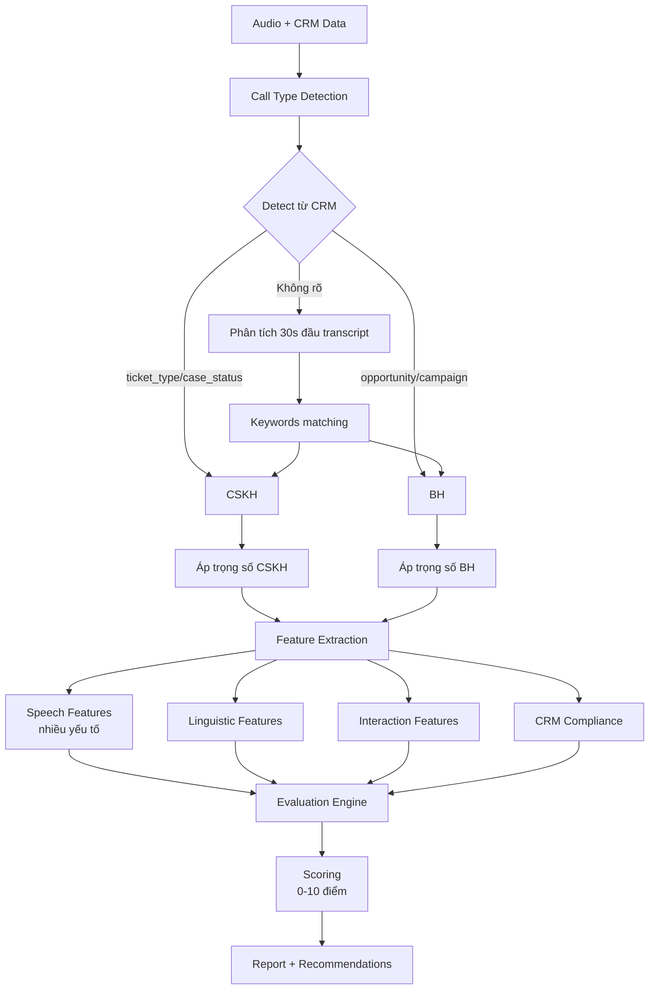
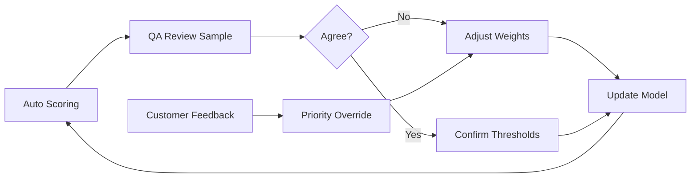

# LUỒNG XỬ LÝ CHẤM ĐIỂM QA CUỘC GỌI

## 1. Tổng quan luồng xử lý



## 2. Chi tiết Call Type Detection

### Input
- CRM record (ticket, opportunity, case, campaign)
- 30 giây đầu transcript

### Quy tắc ưu tiên
```
1. CRM fields (80% độ tin cậy)
   - ticket_type = complaint/support → CSKH
   - opportunity_stage = prospecting → BH
   - case_status = open/escalated → CSKH
   
2. Source/Campaign (60% độ tin cậy)
   - source = hotline/support → CSKH
   - campaign = sales/upsell → BH
   
3. Content analysis (40% độ tin cậy)
   - Keywords matching
   - Sentiment trong 30s đầu
   
4. Default fallback
   - Existing customer → CSKH
   - New lead → BH
```

## 3. Đánh giá tốc độ nói - TỔNG HỢP

### 3.1. Các yếu tố đánh giá (KHÔNG CHỈ SILENCE)

```python
speech_rate_factors = {
    "customer_feedback": {
        "weight": 0.50,  # 50% - QUAN TRỌNG NHẤT
        "signals": [
            "repeat_request_count",
            "explicit_speed_complaint",
            "confusion_indicators"
        ]
    },
    
    "articulation_rate": {
        "weight": 0.30,  # 30%
        "calculation": "words_per_minute_voiced_only",
        "baseline": "team_specific"
    },
    
    "pause_pattern": {
        "weight": 0.20,  # 20% - CHỈ LÀ PHỤ
        "metrics": [
            "pause_ratio",
            "long_pause_count",
            "pause_distribution"
        ]
    }
}
```

### 3.2. Quy tắc tổng hợp

```
IF customer_feedback.negative THEN
    severity = MAX(M2, technical_severity)
    
ELIF technical_violations.multiple THEN
    severity = weighted_average(violations)
    
ELSE
    severity = max_violation_level
```

### 3.3. Ngữ cảnh đặc biệt KHÔNG PHẠT

- **Pause dài nhưng hợp lý**:
  - Đang tra cứu thông tin
  - Đang tính toán cho KH
  - KH yêu cầu chờ
  
- **Nói nhanh nhưng phù hợp**:
  - KH đang vội, yêu cầu nhanh
  - Phần thông tin không quan trọng
  - KH đã quen thuộc với nội dung
  
- **Nói chậm nhưng cần thiết**:
  - Đọc số OTP, số tài khoản
  - Giải thích điều khoản quan trọng
  - KH lớn tuổi hoặc khó nghe

## 4. Ma trận quyết định mức lỗi

### 4.1. Nguyên tắc cơ bản
```
Ảnh hưởng KH > Vi phạm kỹ thuật
Hiểu được > Tốc độ chuẩn
Ngữ cảnh > Ngưỡng cứng
```

### 4.2. Bảng quyết định

| Yếu tố | M1 (Nhẹ) | M2 (Trung bình) | M3 (Nặng) |
|--------|----------|-----------------|-----------|
| **Customer Impact** | KH hỏi lại 1-2 lần | KH hỏi lại >3 lần hoặc phàn nàn | KH hiểu sai/bỏ cuộc |
| **Technical Speed** | Lệch 1-2σ, 20-30% time | Lệch 2-2.5σ, 30-40% time | Lệch >2.5σ, >40% time |
| **Pause Pattern** | Hơi nhiều/ít (±20% baseline) | Quá nhiều/ít (±35% baseline) | Gây gián đoạn nghiêm trọng |
| **Context Violation** | - | Nhanh ở OTP/Terms | Sai info do nói nhanh |

### 4.3. Công thức tính điểm cuối

```python
def calculate_final_severity(factors):
    # Customer impact chiếm ưu tiên cao nhất
    if factors.customer_impact >= "M2":
        return max("M2", factors.technical_severity)
    
    # Weighted scoring nếu nhiều yếu tố
    weighted_score = (
        factors.customer_impact * 0.5 +
        factors.speed_deviation * 0.3 +
        factors.pause_issues * 0.2
    )
    
    if weighted_score > 0.6:
        return "M2"
    elif weighted_score > 0.3:
        return "M1"
    else:
        return "OK"
```

## 5. Báo cáo và Recommendations

### 5.1. Cấu trúc báo cáo

```json
{
  "call_type_detection": {
    "result": "CSKH",
    "confidence": 0.85,
    "method": "CRM_ticket_type",
    "fallback_used": false
  },
  
  "speech_rate_evaluation": {
    "final_severity": "M1",
    "factors": {
      "customer_impact": {
        "level": "OK",
        "evidence": "no_complaints"
      },
      "technical_speed": {
        "level": "M1",
        "evidence": "145wpm_vs_130baseline"
      },
      "pause_pattern": {
        "level": "OK",
        "evidence": "normal_15percent"
      }
    },
    "weighted_decision": "M1 (technical only, no customer impact)"
  },
  
  "recommendations": [
    "Giảm tốc độ nói xuống 130-135 wpm ở phần quan trọng",
    "Giữ nguyên pace hiện tại nếu KH không phàn nàn"
  ]
}
```

### 5.2. Ưu tiên cải thiện

1. **Cao**: Lỗi có customer complaint
2. **Trung**: Lỗi kỹ thuật nhưng KH vẫn OK  
3. **Thấp**: Chỉ số ngoài baseline nhưng phù hợp ngữ cảnh

## 6. Monitoring & Feedback Loop



## 7. Checklist triển khai

- [x] Call type detection từ CRM (không cần input)
- [x] Multi-factor speech rate evaluation
- [x] Customer impact là ưu tiên cao nhất
- [x] Silence/pause chỉ là yếu tố phụ (20%)
- [ ] Context-aware evaluation
- [ ] Continuous calibration
- [ ] Fallback mechanisms