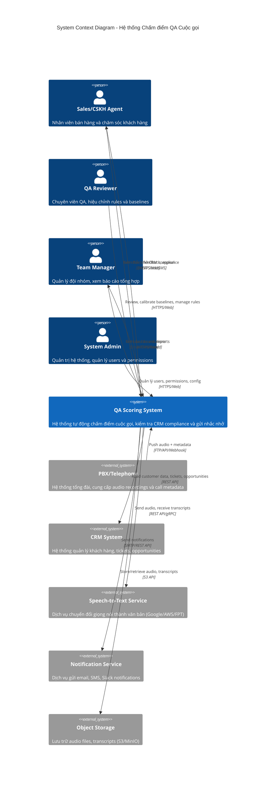

# System Context Diagram - C4 Level 0

## Mục đích
Thể hiện hệ thống QA Call Scoring trong ngữ cảnh tổng thể với các actors và hệ thống bên ngoài.

## Biểu đồ



## Actors (Người dùng)

### 1. Sales/CSKH Agent
- **Vai trò**: Người thực hiện cuộc gọi với khách hàng
- **Tương tác với hệ thống**:
  - Xem điểm số và chi tiết đánh giá của các cuộc gọi
  - Nhận nhắc nhở khi có vi phạm CRM compliance
  - Gửi feedback/appeal nếu không đồng ý với đánh giá
  - Xem recommendations để cải thiện
- **Kênh truy cập**: Web dashboard, mobile app (future), email notifications

### 2. QA Reviewer
- **Vai trò**: Chuyên viên QA, chịu trách nhiệm chất lượng đánh giá
- **Tương tác với hệ thống**:
  - Review sample calls để validate scoring accuracy
  - Calibrate baselines (speech rate, pause patterns...)
  - Điều chỉnh rules và thresholds
  - Xử lý appeals từ agents
  - Xem metrics: MAE, F1 score, false positive rate
- **Kênh truy cập**: Web admin panel

### 3. Team Manager
- **Vai trò**: Quản lý đội Sales/CSKH
- **Tương tác với hệ thống**:
  - Xem dashboard tổng hợp của đội
  - Xem báo cáo violations và resolution rate
  - Theo dõi performance trends
  - Nhận alerts khi có violations nghiêm trọng (M3)
- **Kênh truy cập**: Web dashboard, email reports

### 4. System Admin
- **Vai trò**: Quản trị viên hệ thống
- **Tương tác với hệ thống**:
  - Quản lý users và roles
  - Cấu hình integrations (CRM, PBX, STT)
  - Monitor system health
  - Backup & restore
  - Security settings
- **Kênh truy cập**: Admin console

## External Systems (Hệ thống bên ngoài)

### 1. PBX/Telephony System
- **Chức năng**: Hệ thống tổng đài ghi âm cuộc gọi
- **Dữ liệu cung cấp**:
  - Audio files (WAV/MP3/OGG)
  - Call metadata: call_id, agent_id, customer_phone, call_time, duration
  - Call direction: inbound/outbound
- **Phương thức tích hợp**:
  - **Option A**: FTP/SFTP - PBX upload files định kỳ
  - **Option B**: REST API - PBX push metadata + audio URL
  - **Option C**: Webhook - Real-time notification khi có cuộc gọi mới
- **Tần suất**: Real-time hoặc batch (mỗi 5-15 phút)
- **SLA**: Audio phải có trong vòng 30 phút sau cuộc gọi kết thúc

### 2. CRM System
- **Chức năng**: Quản lý thông tin khách hàng, tickets, opportunities
- **Dữ liệu cần đọc**:
  - Customer info: name, status (new/existing), segment
  - Tickets: ticket_id, category, status, created_at, updated_at
  - Opportunities: opportunity_id, stage, product_interest
  - Campaign/Source: campaign_id, source
  - Notes: ghi chú của agent sau cuộc gọi
- **Phương thức tích hợp**:
  - **Option A**: REST API - Pull data theo call_id hoặc customer_id
  - **Option B**: Database sync - Read replica của CRM database
  - **Option C**: Event stream - Kafka/RabbitMQ real-time events
- **Tần suất**: On-demand (khi cần score call) + Scheduled scan (mỗi 30 phút)
- **Authentication**: OAuth 2.0 hoặc API Key
- **Rate limit**: Cần xem xét để không overload CRM

### 3. Speech-to-Text Service
- **Chức năng**: Chuyển đổi audio thành text
- **Vendors có thể dùng**:
  - Google Cloud Speech-to-Text
  - AWS Transcribe
  - Azure Speech Service
  - FPT.AI Speech-to-Text
  - Whisper (self-hosted)
- **Yêu cầu**:
  - Hỗ trợ tiếng Việt
  - Diarization (phân biệt agent/customer)
  - Timestamps chính xác
  - Word-level confidence scores
- **Output**: JSON với segments, speaker labels, timestamps
- **Performance**: < 2x real-time (cuộc gọi 10 phút → transcript trong 20 phút)
- **Cost consideration**: ~$0.02-0.05 per minute

### 4. Notification Service
- **Chức năng**: Gửi thông báo cho users
- **Kênh**:
  - **Email**: SMTP (SendGrid, AWS SES, Gmail SMTP)
  - **Slack**: Slack API/Webhook
  - **SMS**: Twilio, AWS SNS, local SMS gateway
- **Loại notifications**:
  - CRM compliance reminders (M1/M2/M3)
  - Daily/Weekly reports cho managers
  - Appeals notifications cho QA reviewers
  - System alerts
- **Requirements**:
  - Template engine cho personalized messages
  - Retry mechanism
  - Delivery tracking
  - Unsubscribe handling

### 5. Object Storage
- **Chức năng**: Lưu trữ audio files và transcripts
- **Options**:
  - AWS S3
  - MinIO (self-hosted S3-compatible)
  - Azure Blob Storage
  - Local filesystem (not recommended for production)
- **Data structure**:
  ```
  /audio/
    /2025/01/09/
      CALL-20250109-0001.wav
      CALL-20250109-0002.wav
  /transcripts/
    /2025/01/09/
      CALL-20250109-0001.json
      CALL-20250109-0002.json
  ```
- **Retention policy**: 90 days for audio, 1 year for transcripts
- **Access control**: IAM roles/policies

## Data Flows (Luồng dữ liệu chính)

### Flow 1: Call Scoring (UC01)
```
PBX → [Audio + Metadata] → QA System
QA System → [Audio] → STT Service → [Transcript] → QA System
QA System → [Customer ID] → CRM → [Customer Data] → QA System
QA System → [Call Type + Features] → Scoring Engine → [Score + Report]
QA System → [Report] → Agent Dashboard
```

### Flow 2: CRM Compliance (UC09)
```
Schedule Trigger → QA System
QA System → [Call IDs] → CRM → [CRM Records] → QA System
QA System → Rule Engine → [Violations]
QA System → [Violations] → Reminder Generator → [Reminders]
QA System → [Reminders] → Notification Service → Agent
```

### Flow 3: View Reports (UC02)
```
User → [Request] → QA System → [Query] → Database → [Data]
QA System → [Formatted Report] → User Dashboard
```

## Security Considerations

### Authentication
- **Users**: OAuth 2.0 / SAML SSO với corporate identity provider
- **External APIs**: API Keys hoặc OAuth 2.0 client credentials

### Authorization
- **RBAC**: Role-Based Access Control
  - Agent: read own scores only
  - QA Reviewer: read all, write rules/baselines
  - Manager: read team scores and reports
  - Admin: full access
- **Data isolation**: Agents chỉ thấy data của đội mình

### Data Protection
- **Encryption in transit**: TLS 1.3 cho tất cả connections
- **Encryption at rest**: 
  - Database: encryption at rest enabled
  - Object storage: server-side encryption (SSE-S3/SSE-KMS)
- **PII handling**: 
  - Customer phone numbers masked trong logs
  - Audio retention policy tuân thủ GDPR/local regulations

### Network Security
- **Firewall rules**: Chỉ allow traffic từ known IPs
- **VPN/Private network**: Kết nối với CRM qua VPN
- **API rate limiting**: Prevent abuse

## Performance Requirements

### Throughput
- **Peak load**: 1000 concurrent calls
- **Scoring latency**: 
  - Real-time mode: < 5 seconds after call ends
  - Batch mode: < 10 minutes for 1000 calls
- **CRM scan**: Complete full scan trong < 15 minutes

### Availability
- **Target uptime**: 99.5% (downtime < 4 hours/month)
- **Planned maintenance**: Off-peak hours, < 2 hours/month

### Scalability
- **Horizontal scaling**: Thêm worker nodes khi load tăng
- **Database**: Read replicas cho reporting queries
- **Cache**: Redis cho frequently accessed data (rules, baselines)

## Compliance & Regulations

### Data Retention
- **Audio recordings**: 90 days
- **Transcripts**: 1 year
- **Scores & reports**: 3 years
- **Audit logs**: 1 year

### Privacy
- **GDPR compliance**: Right to access, right to erasure
- **Data anonymization**: Option to anonymize customer data after retention period

### Audit Trail
- **Log all access** to sensitive data
- **Track changes** to rules, baselines, scores
- **Record appeals** and resolutions

## Monitoring & Observability

### Metrics to track
- **System health**: CPU, memory, disk, network
- **Application metrics**: 
  - Calls processed per hour
  - Average scoring time
  - STT success rate
  - CRM API response time
- **Business metrics**:
  - Violation detection rate
  - Reminder resolution rate
  - Average call score
  - Score distribution

### Alerts
- **Critical**: System down, database unreachable, STT service down
- **High**: CRM API slow (> 2s), Disk space > 90%
- **Medium**: High violation rate (> 20%), Low resolution rate (< 80%)

## Questions for Stakeholders

### Về Technical Infrastructure
1. Có infrastructure sẵn chưa? On-premise hay Cloud?
2. Database hiện tại dùng gì? PostgreSQL? MySQL? MongoDB?
3. Message queue có sẵn chưa? RabbitMQ? Kafka?
4. Có budget cho Cloud services (AWS/Azure/GCP)?

### Về Integrations
5. CRM system là gì? Salesforce? SAP? Custom?
6. CRM có API documents không? Rate limits?
7. PBX system dùng gì? Cisco? Avaya? Custom?
8. PBX có hỗ trợ webhook/API không?

### Về Data & Compliance
9. Có yêu cầu compliance đặc biệt? GDPR? SOC2?
10. Audio retention policy từ legal/compliance?
11. Có yêu cầu về data residency (data phải ở VN)?

### Về Users & Access
12. Số lượng users? Agents? QA? Managers?
13. Có SSO/LDAP/Active Directory không?
14. Có mobile app requirement không?

## Next Steps

1. **Stakeholders meeting**: Trả lời các questions trên
2. **Technology decision**: Chọn stack dựa trên constraints và requirements
3. **Container Diagram**: Vẽ chi tiết kiến trúc bên trong hệ thống
4. **Prototype/POC**: Validate technical feasibility cho các integration quan trọng
