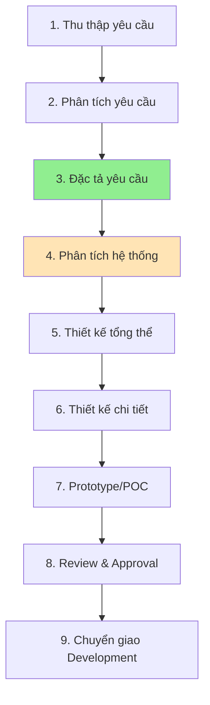

# QUY TRÌNH PHÂN TÍCH VÀ THIẾT KẾ HỆ THỐNG

## Tổng quan các giai đoạn



## Trạng thái hiện tại
✅ **Đã hoàn thành**: Giai đoạn 1-3 (Đặc tả yêu cầu)

## Giai đoạn tiếp theo cần thực hiện

### 📋 GIAI ĐOẠN 4: PHÂN TÍCH HỆ THỐNG (System Analysis)
**Mục tiêu**: Phân tích chi tiết yêu cầu nghiệp vụ để xác định các thành phần hệ thống

#### Các hoạt động chính:

1. **Mô hình hóa nghiệp vụ**
   - Use Case Diagram
   - Activity Diagram cho các luồng chính
   - Sequence Diagram cho tương tác

2. **Phân tích dữ liệu**
   - Entity Relationship Diagram (ERD)
   - Data Dictionary
   - Data Flow Diagram (DFD)

3. **Phân tích chức năng**
   - Functional Decomposition
   - Process Model
   - State Diagram (nếu cần)

4. **Phân tích phi chức năng**
   - Performance requirements analysis
   - Security requirements analysis
   - Integration points mapping

5. **Phân tích stakeholders**
   - User roles và permissions
   - Interface requirements cho từng role

#### Sản phẩm đầu ra:
- 📄 System Analysis Document
- 📊 Các mô hình UML
- 📈 Data models
- 🔍 Gap analysis (nếu có hệ thống cũ)

---

### 🏗️ GIAI ĐOẠN 5: THIẾT KẾ TỔNG THỂ (High-level Design)
**Mục tiêu**: Thiết kế kiến trúc tổng thể của hệ thống

#### Các hoạt động chính:

1. **Thiết kế kiến trúc**
   - System Architecture Diagram
   - Component Diagram
   - Deployment Diagram

2. **Thiết kế công nghệ**
   - Technology stack selection
   - Framework selection
   - Third-party services evaluation

3. **Thiết kế tích hợp**
   - Integration Architecture
   - API Design (high-level)
   - Data flow between systems

4. **Thiết kế bảo mật**
   - Security Architecture
   - Authentication/Authorization design
   - Data protection strategy

5. **Thiết kế hạ tầng**
   - Infrastructure requirements
   - Scalability design
   - High Availability design

#### Sản phẩm đầu ra:
- 📐 Architecture Design Document
- 🗺️ System Architecture Diagrams
- 🔧 Technology Decision Records
- 📋 Non-functional requirements mapping

---

### 🔬 GIAI ĐOẠN 6: THIẾT KẾ CHI TIẾT (Detailed Design)
**Mục tiêu**: Thiết kế chi tiết từng component của hệ thống

#### Các hoạt động chính:

1. **Thiết kế modules**
   - Class Diagrams
   - Package Diagrams
   - Interface specifications

2. **Thiết kế database**
   - Physical Data Model
   - Table designs
   - Index strategy
   - Stored procedures/functions

3. **Thiết kế API**
   - API Specifications (OpenAPI/Swagger)
   - Request/Response schemas
   - Error handling design

4. **Thiết kế UI/UX**
   - Wireframes
   - Mockups
   - User flow diagrams
   - Style guide

5. **Thiết kế algorithms**
   - Core algorithms (scoring, detection, etc.)
   - Business rules implementation
   - Performance optimization

#### Sản phẩm đầu ra:
- 📝 Detailed Design Document
- 🎨 UI/UX Designs
- 📊 Database Design Document
- 📡 API Specifications

---

## Lộ trình đề xuất cho dự án QA Call Scoring

### 🎯 Ưu tiên cao (Cần làm ngay)

#### 1. System Analysis (2 tuần)
```
Tuần 1:
- Use Case Diagram
- Activity Diagram cho scoring flow
- ERD cho call data và scoring results

Tuần 2:
- Sequence Diagrams cho các tương tác chính
- Data Flow Diagrams
- State Diagrams cho call lifecycle
```

#### 2. High-level Design (2 tuần)
```
Tuần 3:
- Architecture Design (microservices vs monolithic)
- Technology stack decision
- Integration architecture với CRM/PBX

Tuần 4:
- Component design
- Deployment architecture
- Security design
```

### 🔄 Tiếp theo (Có thể song song)

#### 3. Proof of Concept (1 tuần)
```
- POC cho speech-to-text
- POC cho call type detection
- POC cho scoring engine cơ bản
```

#### 4. Detailed Design (3 tuần)
```
Tuần 5-6:
- Database design chi tiết
- API specifications
- Scoring algorithms design

Tuần 7:
- UI/UX design
- Report templates
- Dashboard mockups
```

### ✅ Kiểm tra và phê duyệt
```
Tuần 8:
- Technical review
- Business review
- Risk assessment
- Final approval
```

---

## Checklist chuyển giao sang Development

### Tài liệu bắt buộc
- [ ] Requirements Specification (ĐÃ CÓ)
- [ ] System Analysis Document
- [ ] Architecture Design Document
- [ ] Database Design Document
- [ ] API Specifications
- [ ] UI/UX Designs
- [ ] Test Scenarios
- [ ] Deployment Guide (draft)

### Phê duyệt cần có
- [ ] Business approval on requirements
- [ ] Technical approval on architecture
- [ ] Security approval
- [ ] Infrastructure approval
- [ ] Budget approval

### Chuẩn bị cho Development
- [ ] Development environment setup guide
- [ ] Coding standards document
- [ ] Git workflow definition
- [ ] CI/CD pipeline design
- [ ] Definition of Done
- [ ] Sprint planning

---

## Lưu ý quan trọng

### 🚨 Không nên bỏ qua
1. **System Analysis** - Bỏ qua sẽ dẫn đến thiếu sót requirements
2. **Architecture Design** - Bỏ qua sẽ khó scale và maintain
3. **Security Design** - Bỏ qua sẽ có rủi ro bảo mật

### ⚡ Có thể tối ưu
1. **Làm POC sớm** - Validate technical feasibility
2. **Incremental design** - Thiết kế theo iterations
3. **Parallel activities** - UI/UX có thể song song với technical design

### 🎓 Best Practices
1. **Review sớm, review thường xuyên**
2. **Involve stakeholders từ đầu**
3. **Document decisions và rationale**
4. **Maintain traceability** từ requirements đến design
5. **Consider future extensibility**

---

## Recommended Next Steps

### Immediate (Tuần này)
1. ✅ Review và approve Requirements Specification
2. 🚀 Bắt đầu System Analysis
3. 📋 Lập kế hoạch chi tiết cho 8 tuần tới

### Short-term (2 tuần tới)
1. 📊 Hoàn thành Use Cases và Data Models
2. 🔄 POC cho các components có rủi ro kỹ thuật
3. 🤝 Workshop với stakeholders về architecture options

### Medium-term (4 tuần tới)
1. 🏗️ Finalize Architecture Design
2. 💻 Bắt đầu Detailed Design cho core components
3. 👥 Chuẩn bị Development team