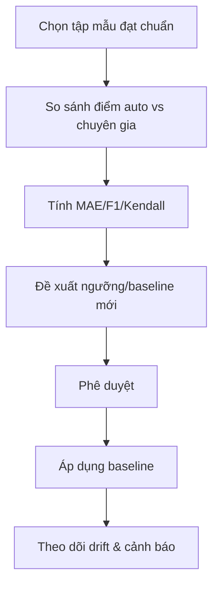

# Activity Diagram – Baseline Calibration

```mermaid
flowchart TD
  A[Chọn tập mẫu đạt chuẩn] --> B[So sánh điểm auto vs chuyên gia]
  B --> C[Tính MAE/F1/Kendall]
  C --> D[Đề xuất ngưỡng/baseline mới]
  D --> E[Phê duyệt]
  E --> F[Áp dụng baseline]
  F --> G[Theo dõi drift & cảnh báo]
```
