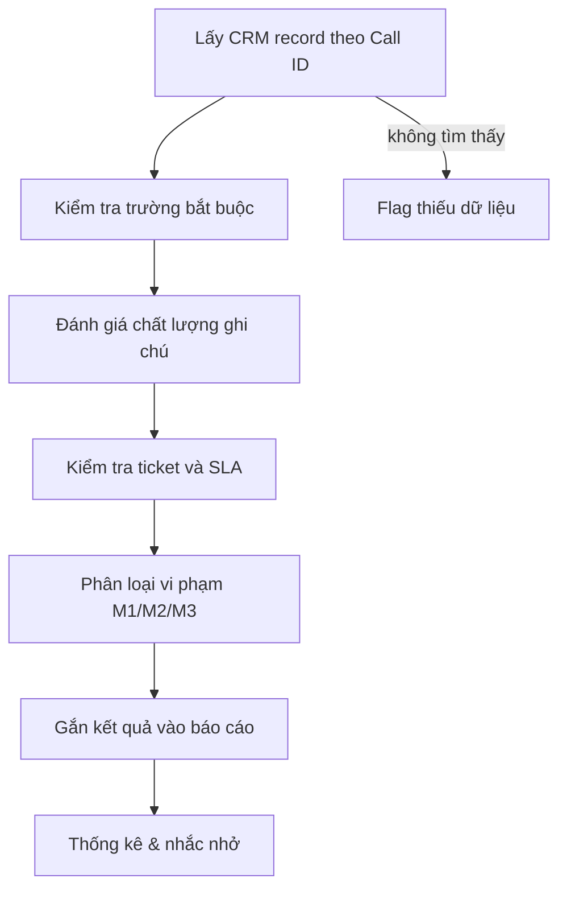

# Activity Diagram – CRM Compliance

```mermaid
flowchart TD
  A[Lấy CRM record theo Call ID] --> B[Kiểm tra trường bắt buộc]
  B --> C[Đánh giá chất lượng ghi chú]
  C --> D[Kiểm tra ticket và SLA]
  D --> E[Phân loại vi phạm M1/M2/M3]
  E --> F[Gắn kết quả vào báo cáo]
  F --> G[Thống kê & nhắc nhở]

  A -- không tìm thấy --> X[Flag thiếu dữ liệu]
```
