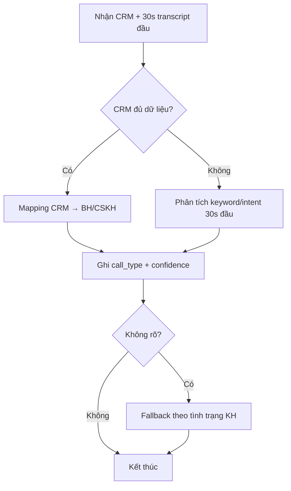

# Activity Diagram – Call Type Detection

```mermaid
flowchart TD
  A[Nhận CRM + 30s transcript đầu] --> B{CRM đủ dữ liệu?}
  B -- Có --> C[Mapping CRM → BH/CSKH]
  B -- Không --> D[Phân tích keyword/intent 30s đầu]
  C --> E[Ghi call_type + confidence]
  D --> E
  E --> F{Không rõ?}
  F -- Có --> G[Fallback theo tình trạng KH]
  F -- Không --> H[Kết thúc]
  G --> H
```
