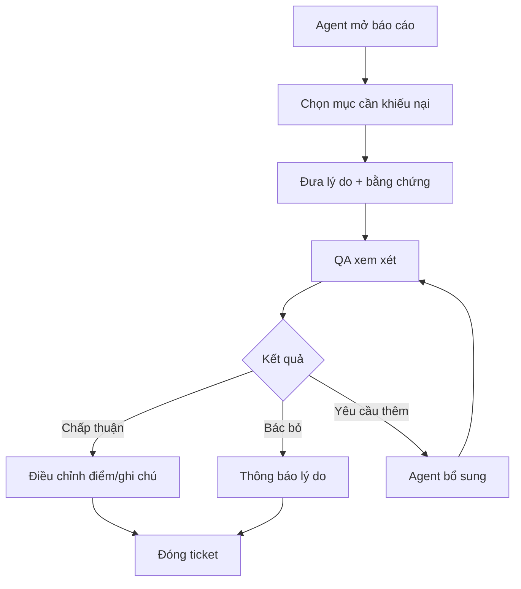

# Activity Diagram – Feedback & Appeal

```mermaid
flowchart TD
  A[Agent mở báo cáo] --> B[Chọn mục cần khiếu nại]
  B --> C[Đưa lý do + bằng chứng]
  C --> D[QA xem xét]
  D --> E{Kết quả}
  E -- Chấp thuận --> F[Điều chỉnh điểm/ghi chú]
  E -- Bác bỏ --> G[Thông báo lý do]
  E -- Yêu cầu thêm --> H[Agent bổ sung]
  F --> I[Đóng ticket]
  G --> I
  H --> D
```
