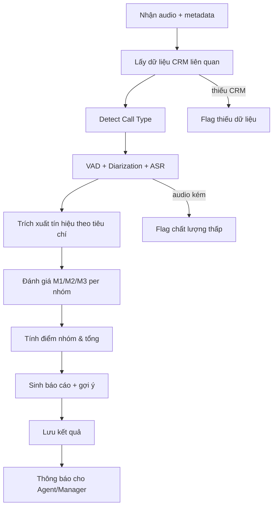

# Activity Diagram – Scoring Flow

```mermaid
flowchart TD
  A[Nhận audio + metadata] --> B[Lấy dữ liệu CRM liên quan]
  B --> C[Detect Call Type]
  C --> D[VAD + Diarization + ASR]
  D --> E[Trích xuất tín hiệu theo tiêu chí]
  E --> F[Đánh giá M1/M2/M3 per nhóm]
  F --> G[Tính điểm nhóm & tổng]
  G --> H[Sinh báo cáo + gợi ý]
  H --> I[Lưu kết quả]
  I --> J[Thông báo cho Agent/Manager]

  B -- thiếu CRM --> C1[Flag thiếu dữ liệu]
  D -- audio kém --> D1[Flag chất lượng thấp]
```
