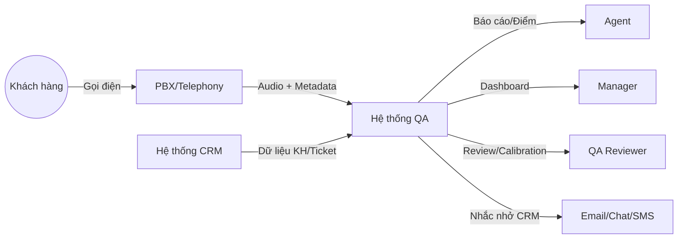
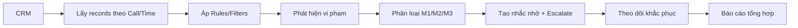

# DFD – Context Level (Level 0)



# DFD – Call Scoring (Level 1)

```mermaid
graph LR
  A[Audio + Metadata] --> B[ASR + Diarization]
  B --> C[Call Type Detection (audio-only)]
  B --> D[Extraction Tín hiệu]
  C --> E[Tính điểm theo nhóm (KNGT/KNBH/NTT)]
  D --> E
  E --> F[Tóm tắt + Khuyến nghị + Kịch bản]
  F --> G[Báo cáo + Lưu trữ]
```

# DFD – CRM Compliance (Level 1)


