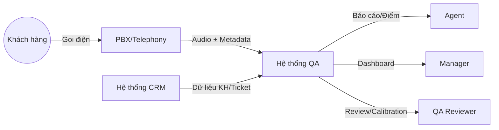
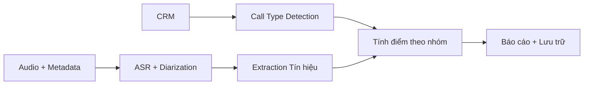
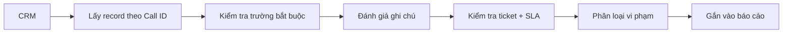

# DFD – Context Level (Level 0)

```mermaid
graph LR
  Customer((Khách hàng)) -- Gọi điện --> PBX[PBX/Telephony]
  PBX -- Audio + Metadata --> QA[Hệ thống QA]
  CRM[Hệ thống CRM] -- Dữ liệu KH/Ticket --> QA
  QA -- Báo cáo/Điểm --> Agent[Agent]
  QA -- Dashboard --> Manager[Manager]
  QA -- Review/Calibration --> QAReviewer[QA Reviewer]
```

# DFD – Scoring Process (Level 1)

```mermaid
graph LR
  A[Audio + Metadata] --> B[ASR + Diarization]
  B --> C[Extraction Tín hiệu]
  CRM[CRM] --> D[Call Type Detection]
  D --> E[Tính điểm theo nhóm]
  C --> E
  E --> F[Báo cáo + Lưu trữ]
```

# DFD – CRM Compliance (Level 1)

```mermaid
graph LR
  CRM[CRM] --> A[Lấy record theo Call ID]
  A --> B[Kiểm tra trường bắt buộc]
  B --> C[Đánh giá ghi chú]
  C --> D[Kiểm tra ticket + SLA]
  D --> E[Phân loại vi phạm]
  E --> F[Gắn vào báo cáo]
```
