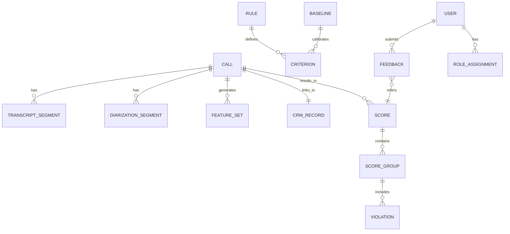

# ERD – Conceptual (Mức khái niệm)

# ERD – Logical (Mức logic)

- CALL(call_id, call_time, duration, agent_id, customer_id, call_type, quality_flags)
- CRM_RECORD(record_id, call_id, customer_status, ticket_id, opportunity_stage, source, campaign, updated_at)
- TRANSCRIPT_SEGMENT(id, call_id, speaker, start_ms, end_ms, text)
- DIARIZATION_SEGMENT(id, call_id, speaker, start_ms, end_ms, confidence)
- FEATURE_SET(id, call_id, wpm_median, pause_ratio, volume_stats, sentiment_stats, interrupt_count, wer_gap, repeat_count)
- SCORE(score_id, call_id, total, label, passed)
- SCORE_GROUP(id, score_id, group_code[KNGT/KNBH/NTT], group_points)
- VIOLATION(id, group_id, criterion_code, level[M1/M2/M3], deduction, evidence_ref)
- CRITERION(code, name, group_code, weight_bh, weight_cskh, description)
- RULE(rule_id, criterion_code, params_json, active, updated_by, updated_at)
- BASELINE(id, metric_code, value, std, cohort, effective_at)
- USER(user_id, name, role)
- ROLE_ASSIGNMENT(id, user_id, role, scope)
- FEEDBACK(id, score_id, user_id, reason, status, created_at, resolved_at)
