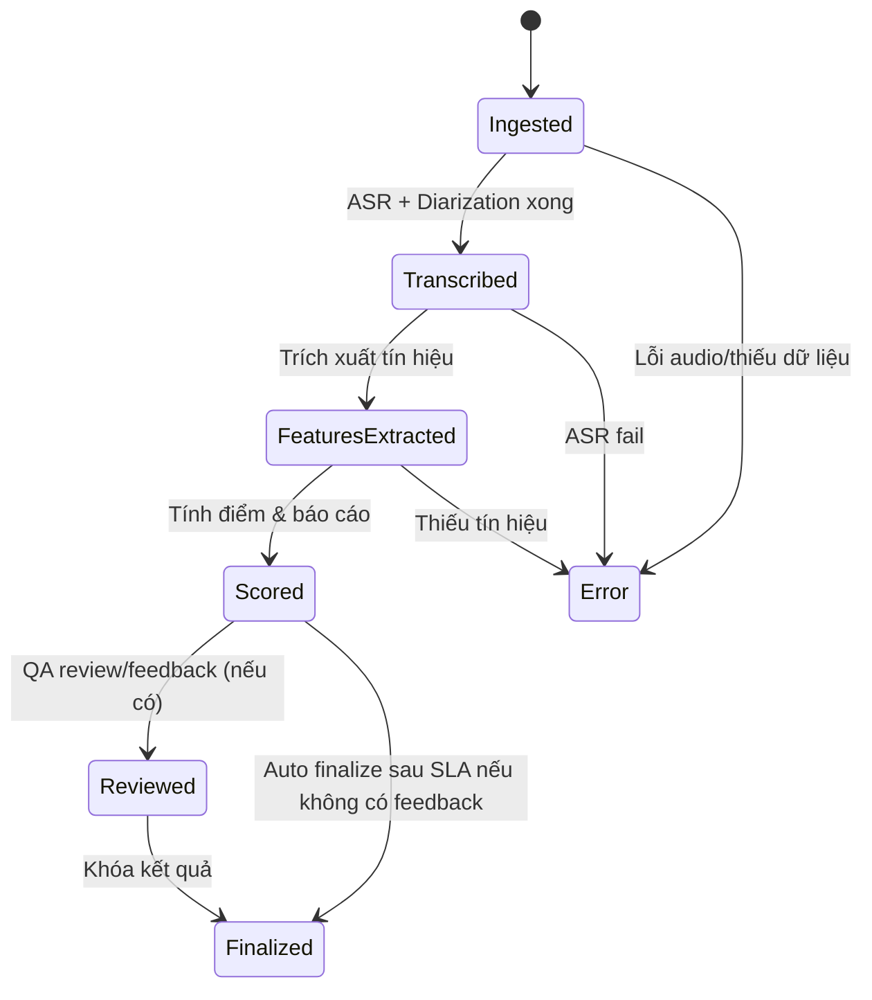

# State Diagram – Vòng đời xử lý/chấm điểm một cuộc gọi

```mermaid
stateDiagram-v2
  [*] --> Ingested
  Ingested --> Transcribed: ASR + Diarization xong
  Transcribed --> FeaturesExtracted: Trích xuất tín hiệu
  FeaturesExtracted --> Scored: Tính điểm & báo cáo
  Scored --> Reviewed: QA review/feedback (nếu có)
  Reviewed --> Finalized: Khóa kết quả
  Scored --> Finalized: Auto finalize sau SLA nếu không có feedback

  Ingested --> Error: Lỗi audio/thiếu dữ liệu
  Transcribed --> Error: ASR fail
  FeaturesExtracted --> Error: Thiếu tín hiệu
```
