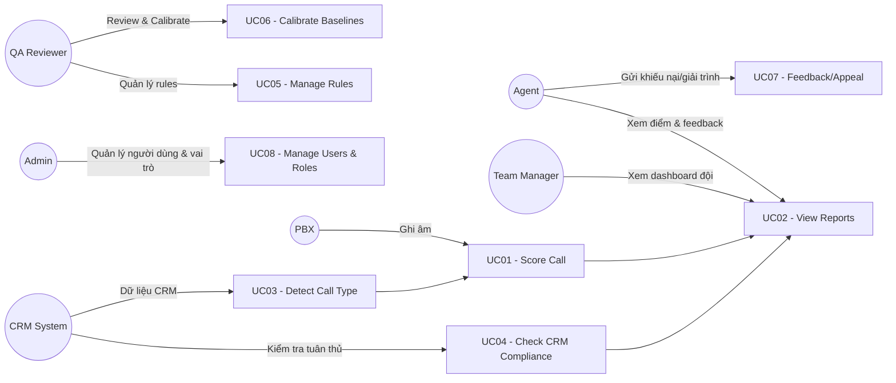

# Use Case Overview – Hệ thống chấm điểm QA cuộc gọi

Phạm vi: Tự động chấm điểm cuộc gọi BH/CSKH, kiểm tra tuân thủ CRM, báo cáo & gợi ý cải thiện. Call type được xác định tự động từ CRM và/hoặc nội dung đầu cuộc gọi.

Diễn viên (Actors):
- Agent (Sales/CSKH)
- QA Reviewer
- Team Manager
- Admin (Quản trị hệ thống)
- CRM System (External)
- PBX/Telephony (External)

Sơ đồ tổng quan (quan hệ actor ↔ use case):

Danh sách Use Case:
- UC01 – Score Call (Hệ thống): Chấm điểm tự động cuộc gọi
- UC02 – View Reports (Agent/QA/Manager): Xem điểm, báo cáo, chi tiết lỗi & gợi ý
- UC03 – Detect Call Type (Hệ thống + CRM): Xác định BH/CSKH
- UC04 – Check CRM Compliance (Hệ thống + CRM): Kiểm tra nhập liệu/ticket/SLA
- UC05 – Manage Rules (Admin/QA): Quản lý rule chấm điểm và trọng số
- UC06 – Calibrate Baselines (QA/Analyst): Hiệu chỉnh baseline, ngưỡng
- UC07 – Feedback/Appeal (Agent/QA): Gửi & xử lý giải trình
- UC08 – Manage Users & Roles (Admin): Quản trị người dùng & phân quyền
