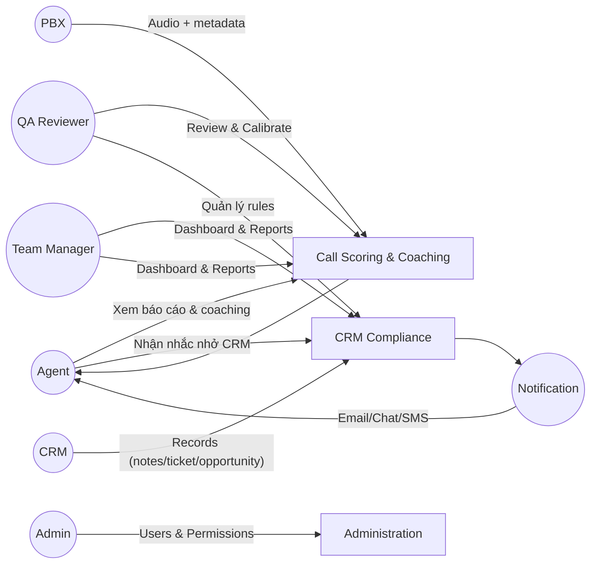

# Use Case Overview – CASE CHUẨN (theo hình)

Phạm vi: Hai CASE chính của hệ thống AI QA Call theo chuẩn:
1) Kiểm tra tuân thủ cập nhật CRM của Sales/CSKH (Compliance)
2) Đánh giá chấm điểm cuộc gọi của Sales trao đổi với KH (Call Scoring & Coaching)

Call type (BH/CSKH) được PHÁT HIỆN TỰ ĐỘNG từ audio/transcript (audio-only). CRM chỉ bắt buộc ở CASE 1 (Compliance) và nhóm NTT trong chấm điểm.

Diễn viên (Actors):
- Agent (Sales/CSKH)
- QA Reviewer
- Team Manager
- Admin (Quản trị hệ thống)
- CRM System (External)
- PBX/Telephony (External)
- Notification Service (External)

Sơ đồ tổng quan (quan hệ actor ↔ case):

CASE & Use Cases tương ứng:
- UC01 – CRM Compliance: Quét rules/bộ lọc → Phát hiện vi phạm M1/M2/M3 → Tạo nhắc nhở & Escalation → Theo dõi khắc phục → Báo cáo tổng hợp
- UC02 – Call Scoring & Coaching: STT + diarization → Phát hiện call_type (audio-only) → Trích xuất tín hiệu → Chấm điểm theo chuẩn KNGT/KNBH/NTT → Tóm tắt → Khuyến nghị theo ngữ cảnh → Gợi ý kịch bản → Báo cáo chi tiết

Các UC hỗ trợ (tùy dự án):
- Manage Rules (Admin/QA): Cấu hình rules, trọng số
- Calibrate Baselines (QA): Hiệu chỉnh baseline/thresholds
- View Reports (Agent/Manager): Truy cập dashboard/báo cáo
- Feedback/Appeal (Agent/QA): Gửi & xử lý khiếu nại
- Manage Users & Roles (Admin): RBAC
