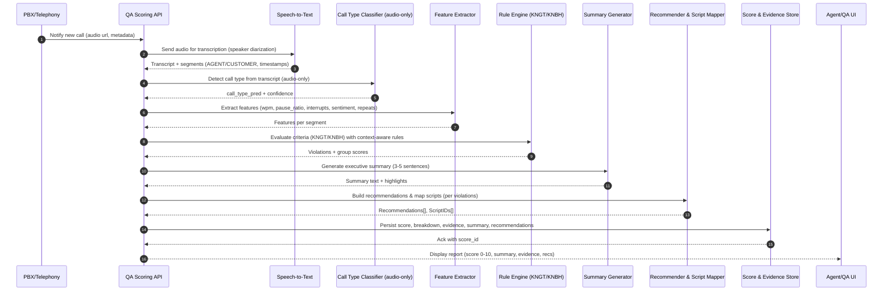

# Sequence Diagram – UC01 Call Scoring (Re-Spec)

Mô tả luồng chi tiết chấm điểm cuộc gọi (không bao gồm CRM compliance).

```mermaid
sequenceDiagram
    autonumber
    participant PBX as PBX/Telephony
    participant QA as QA Scoring API
    participant STT as Speech-to-Text
    participant CLF as Call Type Classifier (audio-only)
    participant FX as Feature Extractor
    participant RE as Rule Engine (KNGT/KNBH)
    participant SUM as Summary Generator
    participant REC as Recommender & Script Mapper
    participant DB as Score & Evidence Store
    participant UI as Agent/QA UI

    PBX->>QA: Notify new call (audio url, metadata)
    QA->>STT: Send audio for transcription (speaker diarization)
    STT-->>QA: Transcript + segments (AGENT/CUSTOMER, timestamps)
    QA->>CLF: Detect call type from transcript (audio-only)
    CLF-->>QA: call_type_pred + confidence
    QA->>FX: Extract features (wpm, pause_ratio, interrupts, sentiment, repeats)
    FX-->>QA: Features per segment

    QA->>RE: Evaluate criteria (KNGT/KNBH) with context-aware rules
    RE-->>QA: Violations + group scores

    QA->>SUM: Generate executive summary (3-5 sentences)
    SUM-->>QA: Summary text + highlights

    QA->>REC: Build recommendations & map scripts (per violations)
    REC-->>QA: Recommendations[], ScriptIDs[]

    QA->>DB: Persist score, breakdown, evidence, summary, recommendations
    DB-->>QA: Ack with score_id

    QA-->>UI: Display report (score 0-10, summary, evidence, recs)
```
