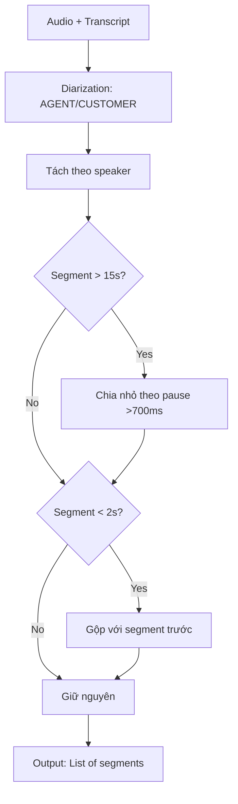

# Chiến lược Chia Segment (Segmentation) – Giải thích Chi tiết

**Phiên bản:** v1.0  
**Mục tiêu:** Giải thích rõ ràng cách chia cuộc gọi thành các segment để đo lường metrics chính xác.

---

## 1. Segment là gì và tại sao cần chia?

### 1.1. Định nghĩa

**Segment** = Một đoạn nói liên tục của một người (AGENT hoặc CUSTOMER) không bị gián đoạn.

```
Ví dụ cuộc gọi thực tế:
┌─────────────────────────────────────────────────────┐
│ [0.0-2.5s] AGENT: "Em xin chào anh ạ"              │ ← Segment 1
│ [3.0-4.5s] CUSTOMER: "Chào em"                      │ ← Segment 2
│ [5.0-12.3s] AGENT: "Em là Hoa từ công ty ABC..."   │ ← Segment 3
│ [13.0-15.2s] CUSTOMER: "Ừ, em nói đi"              │ ← Segment 4
│ [16.0-28.5s] AGENT: "Dạ, em gọi để tư vấn..."     │ ← Segment 5
└─────────────────────────────────────────────────────┘
```

### 1.2. Tại sao không đo toàn bộ cuộc gọi?

❌ **Cách sai:** Tính tốc độ nói của toàn cuộc gọi

**Vấn đề:**
1. **Không phát hiện được dao động:** Agent đầu cuộc gọi nói bình thường (150 wpm), giữa cuộc gọi nói quá nhanh (200 wpm) → nếu tính trung bình sẽ thành 175 wpm, không phát hiện đoạn nói nhanh
2. **Bị nhiễu bởi Customer:** Nếu KH nói nhiều, Agent nói ít → wpm tính chung bị sai
3. **Không định vị được vi phạm:** Không biết lỗi xảy ra ở phút thứ mấy, đoạn nào

✅ **Cách đúng:** Chia thành segments → đo từng segment → tổng hợp thống kê

**Lợi ích:**
- Phát hiện dao động tốc độ theo thời gian
- Tính được outlier ratio (% segments lệch ngưỡng)
- Định vị chính xác vi phạm (timestamps)
- Loại bỏ nhiễu từ Customer

---

## 2. Các loại Segmentation

### 2.1. Speaker-based Segmentation (Theo người nói)

**Nguyên tắc:** Mỗi lần đổi người nói → segment mới

```
Timeline:
0────2.5──3.0────4.5──5.0──────12.3──13.0───15.2──16.0──────28.5
│ AGENT  │  gap  │ CUST  │  gap  │  AGENT   │  gap  │ CUST  │  gap  │ AGENT      │
└───S1───┘       └──S2───┘       └────S3────┘       └──S4───┘       └─────S5─────┘
```

**Ưu điểm:**
- ✅ Đơn giản, dễ hiểu
- ✅ Phù hợp với output của diarization (speaker separation)
- ✅ Tự nhiên với cách con người nghe

**Nhược điểm:**
- ⚠️ Segment có thể rất dài (30-60s) nếu Agent nói liên tục
- ⚠️ Khó phát hiện dao động trong 1 segment dài

**Khi nào dùng:**
- ✅ Đo tốc độ nói (Articulation Rate)
- ✅ Đếm interrupt (cắt lời)
- ✅ Phân tích turn-taking (luân phiên nói)

---

### 2.2. Fixed-duration Segmentation (Theo thời lượng cố định)

**Nguyên tắc:** Chia theo chunks thời gian cố định (ví dụ 5s, 10s)

```
Timeline (chia mỗi 10s):
0────────10────────20────────30────────40
│   S1    │   S2    │   S3    │   S4    │
│ (mixed) │ (mixed) │ (mixed) │ (mixed) │
```

**Ưu điểm:**
- ✅ Segment đều nhau, dễ so sánh
- ✅ Phù hợp cho feature extraction (ML model)

**Nhược điểm:**
- ❌ Cắt ngang câu nói → làm nhiễu metrics
- ❌ Trộn lẫn AGENT và CUSTOMER trong 1 segment
- ❌ Không tự nhiên với ngữ nghĩa

**Khi nào dùng:**
- ⚠️ Huấn luyện ML model (CNN, RNN cần fixed input)
- ❌ KHÔNG dùng để đo tốc độ nói/âm lượng theo người

---

### 2.3. Pause-based Segmentation (Theo im lặng)

**Nguyên tắc:** Chia segment khi có im lặng dài (ví dụ >700ms)

```
AGENT nói liên tục 30s với 3 đoạn dừng dài:
0───────8s───────16s───────25s───────30s
│   S1   │pause │   S2   │pause │  S3  │
└────────┘ 1.2s └────────┘ 0.9s └──────┘
```

**Ưu điểm:**
- ✅ Phân tách theo đơn vị ý nghĩa (thought units)
- ✅ Segment ngắn hơn, phát hiện dao động tốt
- ✅ Phù hợp với cách con người dừng lại giữa các ý

**Nhược điểm:**
- ⚠️ Cần chọn ngưỡng pause hợp lý (700ms? 1000ms?)
- ⚠️ Segment không đều nhau (3s đến 20s)

**Khi nào dùng:**
- ✅ Đo tốc độ nói chi tiết hơn
- ✅ Phân tích cấu trúc lập luận (KNBH)
- ✅ Phát hiện "nói dài dòng/lan man"

---

### 2.4. Hybrid Segmentation (Kết hợp)

**Nguyên tắc:** Speaker-based + pause-based

```
Quy tắc:
1. Ưu tiên chia theo speaker (AGENT/CUSTOMER)
2. Nếu segment của AGENT dài >15s → chia nhỏ theo pause >700ms
3. Segment ngắn <2s → gộp với segment trước (nếu cùng speaker)
```

**Ví dụ:**

```
Timeline:
0──────────────────────────────────────30s
│        AGENT nói liên tục 30s          │
│ (có 2 pause dài: 10s và 20s)          │

Sau khi chia:
0────10s────│pause│────20s────│pause│────30s
│   S1      │ 1.2s│   S2      │ 0.8s│  S3   │
└───────────┘     └───────────┘     └───────┘
```

**Ưu điểm:**
- ✅ Cân bằng giữa tự nhiên và chi tiết
- ✅ Segment vừa phải (5-15s)
- ✅ Phát hiện tốt dao động trong cuộc gọi dài

**Nhược điểm:**
- ⚠️ Phức tạp hơn để implement

**Khi nào dùng:**
- ✅ **ĐỀ XUẤT cho hệ thống AI QA Call**

---

## 3. Chiến lược Segmentation cho AI QA Call (Recommended)

### 3.1. Quy tắc chi tiết

```python
SEGMENTATION_CONFIG = {
    # Quy tắc chính
    "primary_method": "speaker_based",  # Ưu tiên theo người nói
    
    # Quy tắc chia nhỏ segment dài
    "max_segment_duration": 15.0,  # seconds
    "long_pause_threshold": 0.7,   # seconds (700ms)
    
    # Quy tắc gộp segment ngắn
    "min_segment_duration": 2.0,   # seconds
    
    # Quy tắc overlap (cắt lời)
    "overlap_tolerance": 0.2,      # seconds (200ms)
}
```

### 3.2. Pipeline xử lý



### 3.3. Ví dụ thực tế

**Input: Cuộc gọi 120 giây**

```
Raw diarization output:
[
  {"speaker": "AGENT", "start": 0.0, "end": 8.5, "text": "Em xin chào anh..."},
  {"speaker": "CUSTOMER", "start": 9.0, "end": 11.2, "text": "Chào em"},
  {"speaker": "AGENT", "start": 12.0, "end": 45.8, "text": "Em là Hoa từ..."},
  {"speaker": "CUSTOMER", "start": 46.5, "end": 48.3, "text": "Ừ"},
  {"speaker": "AGENT", "start": 49.0, "end": 68.2, "text": "Anh có nhu cầu..."},
  ...
]
```

**Bước 1: Phát hiện segment dài**

Segment #3 (AGENT): 45.8 - 12.0 = 33.8s → **quá dài** (>15s)

**Bước 2: Chạy VAD để tìm pause**

```
AGENT [12.0-45.8s]:
  Voiced: [12.0-18.5], [19.2-28.7], [30.1-38.4], [39.0-45.8]
  Pauses: [18.5-19.2]=0.7s, [28.7-30.1]=1.4s, [38.4-39.0]=0.6s
                      └─ OK!        └─ OK!           └─ Ngắn, bỏ qua
```

**Bước 3: Chia nhỏ**

```
Segment #3 chia thành:
  S3a: [12.0-18.5] "Em là Hoa từ công ty ABC, em gọi để..."
  S3b: [19.2-28.7] "Hiện tại công ty em đang có chương trình..."
  S3c: [30.1-45.8] "Anh có quan tâm đến sản phẩm bảo hiểm..."
```

**Bước 4: Kiểm tra segment ngắn**

Segment #4 (CUSTOMER): 48.3 - 46.5 = 1.8s → **quá ngắn** (<2s)  
→ Gộp với segment sau (nếu cùng speaker) hoặc giữ nguyên (nếu khác speaker)

**Output cuối cùng:**

```json
[
  {
    "segment_id": "S1",
    "speaker": "AGENT",
    "start": 0.0,
    "end": 8.5,
    "duration": 8.5,
    "text": "Em xin chào anh ạ, em là Hoa đây ạ",
    "word_count": 10
  },
  {
    "segment_id": "S2",
    "speaker": "CUSTOMER",
    "start": 9.0,
    "end": 11.2,
    "duration": 2.2,
    "text": "Chào em",
    "word_count": 2
  },
  {
    "segment_id": "S3a",
    "speaker": "AGENT",
    "start": 12.0,
    "end": 18.5,
    "duration": 6.5,
    "text": "Em là Hoa từ công ty ABC, em gọi để...",
    "word_count": 12
  },
  {
    "segment_id": "S3b",
    "speaker": "AGENT",
    "start": 19.2,
    "end": 28.7,
    "duration": 9.5,
    "text": "Hiện tại công ty em đang có chương trình...",
    "word_count": 18
  },
  // ... tiếp tục
]
```

---

## 4. Xử lý các trường hợp đặc biệt

### 4.1. Overlap (Cắt lời)

**Tình huống:** CUSTOMER nói chưa xong, AGENT bắt đầu nói

```
Timeline:
10──────15──────20
│  CUSTOMER   │
      └───AGENT────┘
        │
        └── Overlap zone [15-17s]
```

**Xử lý:**

```python
def handle_overlap(segments):
    """
    Phát hiện và xử lý overlap giữa speakers
    """
    overlaps = []
    
    for i in range(len(segments) - 1):
        seg_current = segments[i]
        seg_next = segments[i + 1]
        
        # Kiểm tra overlap
        if seg_next["start"] < seg_current["end"]:
            overlap_start = seg_next["start"]
            overlap_end = min(seg_current["end"], seg_next["end"])
            overlap_duration = overlap_end - overlap_start
            
            if overlap_duration > 0.2:  # >200ms → cắt lời thật
                overlaps.append({
                    "type": "interrupt",
                    "interrupter": seg_next["speaker"],
                    "interrupted": seg_current["speaker"],
                    "start": overlap_start,
                    "end": overlap_end,
                    "duration": overlap_duration
                })
                
                # Cắt segment bị overlap (giữ phần trước overlap)
                seg_current["end"] = overlap_start
                seg_current["duration"] = overlap_start - seg_current["start"]
    
    return segments, overlaps
```

**Ví dụ:**

```
Trước:
  CUSTOMER [10.0-17.0]: "Em ơi, anh muốn hỏi..."
  AGENT [15.5-20.0]: "Dạ anh cho em..."

Sau xử lý:
  CUSTOMER [10.0-15.5]: "Em ơi, anh muốn hỏi"  ← bị cắt
  AGENT [15.5-20.0]: "Dạ anh cho em..."
  
  + Interrupt event: AGENT cắt lời CUSTOMER tại 15.5s, duration=1.5s
```

### 4.2. Silence dài (Customer thinking)

**Tình huống:** Agent hỏi → im lặng 5s → Customer trả lời

```
Timeline:
10──────15──────────20──────25
│ AGENT │ [silence] │ CUST │
```

**Xử lý:** Không tạo segment cho silence, chỉ lưu gap_duration

```python
segments = [
    {"speaker": "AGENT", "start": 10.0, "end": 15.0, "gap_after": 5.0},
    {"speaker": "CUSTOMER", "start": 20.0, "end": 25.0, "gap_after": 0.0}
]
```

### 4.3. Nhiễu/Background noise

**Tình huống:** Có tiếng ồn, VAD nhầm là nói

```
Xử lý:
1. Kết hợp VAD + ASR confidence
   - Nếu VAD=True nhưng ASR không decode được gì → noise
2. Filter các segment có word_count=0 hoặc confidence<0.3
3. Gắn flag "low_quality" cho segment
```

### 4.4. Code-switching (Trộn tiếng Việt-Anh)

**Tình huống:** "Em sẽ gửi anh cái email ạ"

```
Xử lý:
1. Đếm từ bình thường (email = 1 từ)
2. ASR tốt sẽ nhận diện được
3. Không cần xử lý đặc biệt
```

---

## 5. Implementation Code (Python)

### 5.1. Class Segment

```python
from dataclasses import dataclass
from typing import List, Optional

@dataclass
class Segment:
    """Đại diện cho 1 segment nói"""
    segment_id: str
    speaker: str  # "AGENT" or "CUSTOMER"
    start: float  # seconds
    end: float    # seconds
    text: str
    
    # Tính toán
    @property
    def duration(self) -> float:
        return self.end - self.start
    
    @property
    def word_count(self) -> int:
        return len(self.text.strip().split())
    
    # Metadata
    gap_after: float = 0.0  # silence sau segment này
    voiced_duration: Optional[float] = None  # thời lượng phát âm thực tế (từ VAD)
    confidence: float = 1.0  # ASR confidence
    flags: List[str] = None  # ["low_quality", "overlap", ...]
    
    def __post_init__(self):
        if self.flags is None:
            self.flags = []
```

### 5.2. Segmenter Class

```python
import numpy as np
from typing import List, Tuple

class CallSegmenter:
    """Chia cuộc gọi thành segments"""
    
    def __init__(self, config: dict):
        self.max_duration = config.get("max_segment_duration", 15.0)
        self.min_duration = config.get("min_segment_duration", 2.0)
        self.long_pause_threshold = config.get("long_pause_threshold", 0.7)
        self.overlap_tolerance = config.get("overlap_tolerance", 0.2)
    
    def segment_call(self, 
                     diarization_output: List[dict],
                     vad_output: np.ndarray) -> List[Segment]:
        """
        Pipeline chính
        
        Args:
            diarization_output: [{"speaker": "AGENT", "start": 0.0, "end": 5.0, "text": "..."}]
            vad_output: numpy array (1 = voiced, 0 = silence) @ 10ms resolution
        
        Returns:
            List of Segment objects
        """
        # Bước 1: Chuyển đổi sang Segment objects
        segments = [
            Segment(
                segment_id=f"S{i+1}",
                speaker=seg["speaker"],
                start=seg["start"],
                end=seg["end"],
                text=seg["text"]
            )
            for i, seg in enumerate(diarization_output)
        ]
        
        # Bước 2: Chia nhỏ segments dài
        segments = self._split_long_segments(segments, vad_output)
        
        # Bước 3: Gộp segments ngắn
        segments = self._merge_short_segments(segments)
        
        # Bước 4: Tính gap_after
        segments = self._calculate_gaps(segments)
        
        # Bước 5: Phát hiện overlap
        segments, overlaps = self._detect_overlaps(segments)
        
        # Bước 6: Tính voiced_duration (từ VAD)
        segments = self._calculate_voiced_duration(segments, vad_output)
        
        return segments, overlaps
    
    def _split_long_segments(self, 
                            segments: List[Segment], 
                            vad_output: np.ndarray) -> List[Segment]:
        """Chia nhỏ segments dài >15s"""
        result = []
        
        for seg in segments:
            if seg.duration <= self.max_duration:
                result.append(seg)
            else:
                # Tìm pause dài trong segment này
                pauses = self._find_pauses(seg.start, seg.end, vad_output)
                
                if len(pauses) == 0:
                    # Không có pause dài → giữ nguyên nhưng gắn flag
                    seg.flags.append("long_segment_no_pause")
                    result.append(seg)
                else:
                    # Chia theo pause
                    sub_segments = self._split_by_pauses(seg, pauses)
                    result.extend(sub_segments)
        
        return result
    
    def _find_pauses(self, 
                    start: float, 
                    end: float, 
                    vad_output: np.ndarray) -> List[Tuple[float, float]]:
        """
        Tìm các đoạn im lặng dài >threshold trong khoảng [start, end]
        
        Returns:
            List of (pause_start, pause_end) in seconds
        """
        # VAD @ 10ms resolution
        frame_duration = 0.01
        start_frame = int(start / frame_duration)
        end_frame = int(end / frame_duration)
        
        vad_segment = vad_output[start_frame:end_frame]
        
        pauses = []
        in_pause = False
        pause_start_frame = 0
        
        for i, is_voiced in enumerate(vad_segment):
            if is_voiced == 0:  # silence
                if not in_pause:
                    in_pause = True
                    pause_start_frame = i
            else:  # voiced
                if in_pause:
                    pause_duration = (i - pause_start_frame) * frame_duration
                    if pause_duration >= self.long_pause_threshold:
                        pause_start_sec = start + pause_start_frame * frame_duration
                        pause_end_sec = start + i * frame_duration
                        pauses.append((pause_start_sec, pause_end_sec))
                    in_pause = False
        
        return pauses
    
    def _split_by_pauses(self, 
                        segment: Segment, 
                        pauses: List[Tuple[float, float]]) -> List[Segment]:
        """Chia segment thành nhiều phần theo pauses"""
        sub_segments = []
        current_start = segment.start
        
        # TODO: Cần có transcript với timestamps để chia text chính xác
        # Giả sử đơn giản: chia text theo tỷ lệ thời gian
        words = segment.text.split()
        total_duration = segment.duration
        
        for pause_start, pause_end in pauses:
            # Tạo sub-segment trước pause
            duration_ratio = (pause_start - current_start) / total_duration
            word_count = int(len(words) * duration_ratio)
            sub_text = " ".join(words[:word_count])
            
            sub_seg = Segment(
                segment_id=f"{segment.segment_id}_split",
                speaker=segment.speaker,
                start=current_start,
                end=pause_start,
                text=sub_text
            )
            sub_segments.append(sub_seg)
            
            # Cập nhật cho lần chia tiếp theo
            current_start = pause_end
            words = words[word_count:]
        
        # Sub-segment cuối cùng
        sub_seg = Segment(
            segment_id=f"{segment.segment_id}_split",
            speaker=segment.speaker,
            start=current_start,
            end=segment.end,
            text=" ".join(words)
        )
        sub_segments.append(sub_seg)
        
        return sub_segments
    
    def _merge_short_segments(self, segments: List[Segment]) -> List[Segment]:
        """Gộp segments ngắn <2s với segment trước (nếu cùng speaker)"""
        result = []
        i = 0
        
        while i < len(segments):
            seg = segments[i]
            
            if seg.duration < self.min_duration and len(result) > 0:
                prev_seg = result[-1]
                
                if prev_seg.speaker == seg.speaker:
                    # Gộp vào segment trước
                    prev_seg.end = seg.end
                    prev_seg.text += " " + seg.text
                    prev_seg.flags.append("merged")
                else:
                    # Khác speaker, giữ nguyên nhưng gắn flag
                    seg.flags.append("short_segment")
                    result.append(seg)
            else:
                result.append(seg)
            
            i += 1
        
        return result
    
    def _calculate_gaps(self, segments: List[Segment]) -> List[Segment]:
        """Tính gap_after cho mỗi segment"""
        for i in range(len(segments) - 1):
            gap = segments[i+1].start - segments[i].end
            segments[i].gap_after = max(0, gap)  # đảm bảo không âm
        
        return segments
    
    def _detect_overlaps(self, 
                        segments: List[Segment]) -> Tuple[List[Segment], List[dict]]:
        """Phát hiện và xử lý overlap"""
        overlaps = []
        
        for i in range(len(segments) - 1):
            seg_current = segments[i]
            seg_next = segments[i + 1]
            
            if seg_next.start < seg_current.end:
                overlap_duration = seg_current.end - seg_next.start
                
                if overlap_duration > self.overlap_tolerance:
                    # Overlap thật sự (cắt lời)
                    overlaps.append({
                        "type": "interrupt",
                        "interrupter": seg_next.speaker,
                        "interrupted": seg_current.speaker,
                        "start": seg_next.start,
                        "end": min(seg_current.end, seg_next.end),
                        "duration": overlap_duration
                    })
                    
                    # Cắt segment bị overlap
                    seg_current.end = seg_next.start
                    seg_current.flags.append("interrupted")
                    seg_next.flags.append("interrupter")
        
        return segments, overlaps
    
    def _calculate_voiced_duration(self, 
                                   segments: List[Segment], 
                                   vad_output: np.ndarray) -> List[Segment]:
        """Tính thời lượng phát âm thực tế (loại bỏ silence)"""
        frame_duration = 0.01
        
        for seg in segments:
            start_frame = int(seg.start / frame_duration)
            end_frame = int(seg.end / frame_duration)
            vad_segment = vad_output[start_frame:end_frame]
            
            voiced_frames = np.sum(vad_segment == 1)
            seg.voiced_duration = voiced_frames * frame_duration
        
        return segments
```

### 5.3. Usage Example

```python
# Config
config = {
    "max_segment_duration": 15.0,
    "min_segment_duration": 2.0,
    "long_pause_threshold": 0.7,
    "overlap_tolerance": 0.2
}

# Dữ liệu đầu vào (từ STT + Diarization)
diarization_output = [
    {"speaker": "AGENT", "start": 0.0, "end": 8.5, 
     "text": "Em xin chào anh ạ, em là Hoa đây ạ"},
    {"speaker": "CUSTOMER", "start": 9.0, "end": 11.2, 
     "text": "Chào em"},
    # ... thêm nhiều segments
]

# VAD output (giả sử)
vad_output = np.array([...])  # 1=voiced, 0=silence @ 10ms

# Chạy segmentation
segmenter = CallSegmenter(config)
segments, overlaps = segmenter.segment_call(diarization_output, vad_output)

# In kết quả
for seg in segments:
    print(f"{seg.segment_id} [{seg.start:.1f}-{seg.end:.1f}s] "
          f"{seg.speaker}: {seg.text[:30]}... "
          f"(duration={seg.duration:.1f}s, "
          f"voiced={seg.voiced_duration:.1f}s, "
          f"words={seg.word_count})")

print(f"\nTotal interrupts: {len(overlaps)}")
```

---

## 6. Lưu ý khi triển khai

### 6.1. Chọn threshold pause

**Gợi ý ban đầu:**
- `long_pause_threshold = 0.7s` (700ms) cho tiếng Việt
- Lý do: Pause tự nhiên giữa các câu ~300-500ms; pause giữa các ý ~700-1200ms

**Cách tinh chỉnh:**
1. Lấy 50 cuộc gọi mẫu
2. QA nghe và đánh dấu "đây là điểm nên chia"
3. Đo pause_duration tại các điểm đó → tính trung bình
4. Chọn threshold = median(pause_durations)

### 6.2. Xử lý transcript không có timestamps chi tiết

**Vấn đề:** Một số STT chỉ trả về:
```json
{
  "speaker": "AGENT",
  "start": 10.0,
  "end": 30.0,
  "text": "Em xin chào anh. Em là Hoa. Em gọi để tư vấn..."
}
```

Không có timestamps từng từ → **không chia text chính xác theo pause**

**Giải pháp:**

1. **Cách 1 (Đơn giản):** Chia text theo tỷ lệ thời gian
   ```python
   # Nếu chia segment [10s-30s] tại pause 18s
   # → 18-10=8s (40% tổng 20s) → lấy 40% số từ
   ```

2. **Cách 2 (Tốt hơn):** Dùng forced alignment
   ```python
   # Tool: gentle, aeneas, Montreal Forced Aligner
   # → Align từng từ với audio → có timestamps chi tiết
   ```

3. **Cách 3 (Best):** Dùng STT tốt (Whisper, Google STT) trả về word-level timestamps

### 6.3. Performance optimization

**Vấn đề:** Xử lý cuộc gọi dài (30-60 phút) tốn thời gian

**Tối ưu:**
1. Cache VAD output (chỉ chạy 1 lần)
2. Parallel processing cho nhiều cuộc gọi
3. Dùng numpy vectorization thay vì loop

---

## 7. Ví dụ đầy đủ từ đầu đến cuối

### Input: Cuộc gọi 60 giây

```
Audio file: call_12345.wav (mono, 16kHz)
```

### Bước 1: STT + Diarization

```python
# Sử dụng tool: Whisper + pyannote.audio
from whisper import load_model
from pyannote.audio import Pipeline

# STT
model = load_model("large-v2")
result = model.transcribe("call_12345.wav")

# Diarization
pipeline = Pipeline.from_pretrained("pyannote/speaker-diarization")
diarization = pipeline("call_12345.wav")

# Kết hợp
diarization_output = combine_stt_diarization(result, diarization)
# → [{"speaker": "AGENT", "start": 0.0, "end": 5.0, "text": "..."}]
```

### Bước 2: VAD

```python
import webrtcvad
import wave

# Đọc audio
wf = wave.open("call_12345.wav", 'rb')
audio_data = wf.readframes(wf.getnframes())

# VAD
vad = webrtcvad.Vad(2)  # aggressiveness=2
vad_output = compute_vad(audio_data, vad)
# → np.array([1,1,1,0,0,1,1,...])  @ 10ms resolution
```

### Bước 3: Segmentation

```python
segmenter = CallSegmenter(config)
segments, overlaps = segmenter.segment_call(diarization_output, vad_output)
```

### Bước 4: Tính Articulation Rate

```python
def calculate_wpm_for_segments(segments):
    """Tính wpm cho mỗi segment của AGENT"""
    agent_segments = [s for s in segments if s.speaker == "AGENT"]
    
    wpm_list = []
    for seg in agent_segments:
        if seg.voiced_duration and seg.voiced_duration >= 1.0:
            wpm = 60.0 * seg.word_count / seg.voiced_duration
            wpm_list.append({
                "segment_id": seg.segment_id,
                "wpm": wpm,
                "start": seg.start,
                "text_preview": seg.text[:50]
            })
    
    return wpm_list

wpm_results = calculate_wpm_for_segments(segments)

# Tổng hợp
import numpy as np
wpm_values = [r["wpm"] for r in wpm_results]
median_wpm = np.median(wpm_values)
p90_wpm = np.percentile(wpm_values, 90)

print(f"Median WPM: {median_wpm:.1f}")
print(f"P90 WPM: {p90_wpm:.1f}")
```

### Output

```
Segments:
  S1 [0.0-8.5s] AGENT: Em xin chào anh ạ, em là Hoa... (wpm=145.2)
  S2 [9.0-11.2s] CUSTOMER: Chào em (wpm=N/A)
  S3a [12.0-18.5s] AGENT: Em là Hoa từ công ty ABC... (wpm=152.8)
  S3b [19.2-28.7s] AGENT: Hiện tại công ty em đang có... (wpm=168.3)
  S4 [29.0-31.5s] CUSTOMER: Ừ, em nói tiếp đi (wpm=N/A)
  S5 [32.0-45.8s] AGENT: Dạ, anh có nhu cầu mua bảo hiểm... (wpm=195.7) ← Nhanh!
  ...

Summary:
  Median WPM (AGENT): 158.3
  P90 WPM: 192.1
  Outlier ratio (±1σ): 28% (> 20% → M1)
  
  Violation:
    - M1: Tốc độ nói
    - Evidence: Segment S5 [32.0-45.8s] wpm=195.7 (>185 threshold)
```

---

## 8. Tóm tắt (Cheat Sheet)

### Quy tắc chia segment

```
1. Ưu tiên: Speaker-based (AGENT/CUSTOMER)
2. Nếu segment >15s: Chia theo pause >700ms
3. Nếu segment <2s: Gộp với segment trước (cùng speaker)
4. Tính gap_after = next.start - current.end
5. Phát hiện overlap >200ms → interrupt event
6. Tính voiced_duration bằng VAD (loại silence)
```

### Config khuyến nghị

```python
{
    "max_segment_duration": 15.0,   # seconds
    "min_segment_duration": 2.0,    # seconds
    "long_pause_threshold": 0.7,    # seconds
    "overlap_tolerance": 0.2        # seconds
}
```

### Output mong muốn

```python
Segment(
    segment_id="S3a",
    speaker="AGENT",
    start=12.0,
    end=18.5,
    text="Em là Hoa từ công ty ABC...",
    duration=6.5,
    word_count=12,
    voiced_duration=5.8,  # loại silence
    gap_after=0.7,
    confidence=0.95,
    flags=[]
)
```

---

## Kết luận

**Ý tưởng cốt lõi:**
1. Chia theo **speaker** (AGENT/CUSTOMER) là chính
2. Chia nhỏ segments dài theo **pause >700ms**
3. Gộp segments ngắn <2s (cùng speaker)
4. Phát hiện và xử lý **overlap** (cắt lời)
5. Tính **voiced_duration** bằng VAD để có Articulation Rate chính xác

**Tại sao quan trọng:**
- Segment đúng → metrics chính xác
- Phát hiện dao động tốc độ nói theo thời gian
- Định vị chính xác vi phạm (timestamps)
- Tách biệt AGENT và CUSTOMER

**Tools cần thiết:**
- STT: Whisper, Google Cloud STT, Azure Speech
- Diarization: pyannote.audio, AWS Transcribe
- VAD: webrtcvad, silero-vad, pyannote.audio
- Forced alignment (optional): gentle, Montreal Forced Aligner

---

**Liên kết:**
- [Speech Rate Measurement](./06_Speech_Rate_Measurement_Deep_Dive.md)
- [Master Spec](./00_Master_Spec.md)
- [Scoring Criteria](./05_Scoring_Criteria_Decomposition.md)
