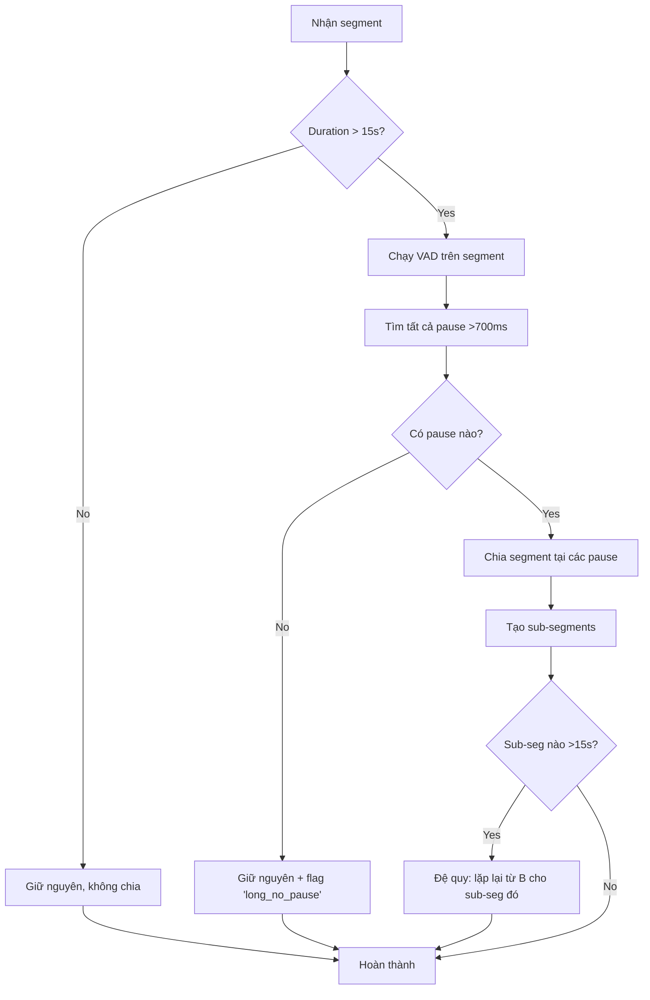

# Hướng dẫn Trực quan: Chia Segment Dài Theo Pause

**Mục tiêu:** Giải thích **từng bước** cách chia một segment dài thành nhiều segment nhỏ dựa trên pause (im lặng).

---

## Phần 1: Hiểu vấn đề cơ bản

### Tình huống

Agent nói liên tục **30 giây** không dừng:

```
Timeline:
0─────────────────────────────────────────30s
│          AGENT nói liên tục              │
└──────────────────────────────────────────┘
```

**Transcript:**
```
"Em xin chào anh ạ, em là Hoa từ công ty ABC. [DỪNG 1.2s] 
Hiện tại công ty em đang có chương trình bảo hiểm ưu đãi. [DỪNG 0.8s]
Anh có quan tâm đến sản phẩm bảo hiểm nhân thọ không ạ?"
```

### Vấn đề

- Segment dài 30s → **quá dài** (ngưỡng max = 15s)
- Nếu không chia → không phát hiện được dao động tốc độ giữa các đoạn
- Ví dụ: Đoạn 1 nói 140 wpm (chậm), đoạn 2 nói 180 wpm (nhanh) → bị che khuất

### Giải pháp

**Chia segment dài thành nhiều segment nhỏ dựa trên PAUSE (im lặng dài)**

---

## Phần 2: Pause là gì?

### 2.1. Định nghĩa

**Pause** = Khoảng im lặng giữa các đoạn nói của cùng 1 người

```
Agent: "Em xin chào anh ạ" [im lặng 1.2s] "Em là Hoa"
                           └────────────┘
                            Đây là PAUSE
```

### 2.2. Phân loại pause

| Loại | Thời lượng | Ý nghĩa | Ví dụ |
|------|------------|---------|-------|
| **Micro pause** | 50-200ms | Hít thở, ngắt giữa từ | "Em... là Hoa" |
| **Short pause** | 200-500ms | Ngắt giữa các câu | "Chào anh. Em là Hoa." |
| **Long pause** | 700ms+ | Ngắt giữa các ý lớn | "Chào anh. [1.2s] Hôm nay em gọi để..." |

### 2.3. Ngưỡng chọn: 700ms

**Tại sao 700ms?**
- Pause tự nhiên giữa câu: ~300-500ms → **KHÔNG chia**
- Pause giữa các ý/đoạn: ~700-1500ms → **CHIA**
- Cân bằng: không chia quá nhỏ, không để quá dài

---

## Phần 3: Ví dụ cụ thể từng bước

### Input

**Audio segment của AGENT:**
```
Duration: 30 giây (quá dài, cần chia)
Start: 10.0s
End: 40.0s
Text: "Em xin chào anh ạ, em là Hoa từ công ty ABC. Hiện tại công ty em đang có chương trình bảo hiểm ưu đãi đặc biệt. Anh có quan tâm đến sản phẩm bảo hiểm nhân thọ không ạ?"
```

---

### Bước 1: Chạy VAD (Voice Activity Detection)

**VAD = Phát hiện đâu là nói, đâu là im lặng**

```python
# Input: Audio signal
# Output: Array nhị phân (1=nói, 0=im lặng) @ 10ms resolution

VAD output (simplified):
Time:  10.0  10.5  11.0  15.0  18.0  18.5  19.3  28.0  29.0  30.0  31.0  40.0
       ├─────┴─────┴─────┴─────┼─────┼─────┴─────┴─────┼─────┼─────┴─────┤
Voice: [1 1 1 1 1 1 1 1 1 ... 0 0 0 ... 1 1 1 1 ... 0 0 ... 1 1 1 1 ...]
       └─────Voiced─────────────┘     └───Voiced────────┘     └─Voiced──┘
```

**Giải thích:**
- `1` = Có tiếng nói (voiced)
- `0` = Im lặng (silence)
- VAD chạy trên từng frame 10ms

**Kết quả VAD cho segment này:**

```
Timeline: 10.0────────────────────────────────────40.0s

Voiced blocks:
  [10.0 - 18.0s]  ← Agent đang nói (8.0s)
  [18.0 - 19.3s]  ← Im lặng (1.3s) ← PAUSE DÀI!
  [19.3 - 29.0s]  ← Agent đang nói (9.7s)
  [29.0 - 30.0s]  ← Im lặng (1.0s) ← PAUSE DÀI!
  [30.0 - 40.0s]  ← Agent đang nói (10.0s)
```

**Trực quan:**

```
10────────18──19.3────────29──30─────────40s
│ VOICED  │gap│ VOICED   │gap│ VOICED   │
│ 8.0s    │1.3│ 9.7s     │1.0│ 10.0s    │
└─────────┘   └──────────┘   └──────────┘
     A            B              C
```

---

### Bước 2: Tìm pause dài (>700ms)

**Quy tắc:** Chỉ chia tại pause ≥ 700ms

```python
# Quét qua VAD output, tìm khoảng silence dài

Pauses tìm được:
1. Pause [18.0 - 19.3s]: duration = 1.3s (>700ms) ✅ CHẤP NHẬN
2. Pause [29.0 - 30.0s]: duration = 1.0s (>700ms) ✅ CHẤP NHẬN
```

**Nếu có pause ngắn (<700ms):**
```
# Giả sử có pause [25.0 - 25.3s]: duration = 0.3s
# → KHÔNG chia vì quá ngắn (chỉ là ngắt câu tự nhiên)
```

---

### Bước 3: Chia segment thành 3 phần

**Dựa trên 2 pause dài → chia thành 3 sub-segments**

```
Original segment:
  [10.0 - 40.0s] AGENT (30s)

Sau khi chia:
  Sub-segment A: [10.0 - 18.0s] (8.0s)
  Sub-segment B: [19.3 - 29.0s] (9.7s)  
  Sub-segment C: [30.0 - 40.0s] (10.0s)
```

**Trực quan:**

```
TRƯỚC chia:
┌──────────────────────────────────────────────────┐
│         Segment gốc [10.0 - 40.0s]               │
│              Duration: 30.0s                     │
└──────────────────────────────────────────────────┘

SAU chia:
┌──────────────┐   ┌──────────────┐   ┌──────────────┐
│ Sub-seg A    │   │ Sub-seg B    │   │ Sub-seg C    │
│ [10.0-18.0s] │   │ [19.3-29.0s] │   │ [30.0-40.0s] │
│    8.0s      │   │    9.7s      │   │    10.0s     │
└──────────────┘   └──────────────┘   └──────────────┘
```

---

### Bước 4: Chia text tương ứng

**Vấn đề:** Làm sao biết đoạn text nào thuộc sub-segment nào?

#### Cách 1: Dùng tỷ lệ thời gian (đơn giản)

```python
Original text:
"Em xin chào anh ạ, em là Hoa từ công ty ABC. 
Hiện tại công ty em đang có chương trình bảo hiểm ưu đãi đặc biệt. 
Anh có quan tâm đến sản phẩm bảo hiểm nhân thọ không ạ?"

Word count: 30 từ
Total duration: 30s

Sub-segment A: [10.0-18.0s] = 8.0s
  → Tỷ lệ: 8.0/30 = 26.7% → lấy 26.7% số từ = 8 từ đầu
  → Text: "Em xin chào anh ạ, em là Hoa"

Sub-segment B: [19.3-29.0s] = 9.7s  
  → Tỷ lệ: 9.7/30 = 32.3% → lấy 32.3% số từ tiếp theo = ~10 từ
  → Text: "từ công ty ABC. Hiện tại công ty em đang có"

Sub-segment C: [30.0-40.0s] = 10.0s
  → Tỷ lệ: 10.0/30 = 33.3% → lấy phần còn lại = ~12 từ
  → Text: "chương trình bảo hiểm ưu đãi đặc biệt. Anh có quan tâm..."
```

**Ưu điểm:** Đơn giản, không cần công cụ phức tạp  
**Nhược điểm:** Không chính xác 100%, có thể cắt ngang câu

#### Cách 2: Dùng timestamps từng từ (chính xác)

**Yêu cầu:** STT phải trả về timestamps cho từng từ

```json
{
  "words": [
    {"word": "Em", "start": 10.0, "end": 10.2},
    {"word": "xin", "start": 10.2, "end": 10.4},
    {"word": "chào", "start": 10.4, "end": 10.7},
    {"word": "anh", "start": 10.7, "end": 11.0},
    {"word": "ạ", "start": 11.0, "end": 11.2},
    // ... từ "từ" bắt đầu sau pause 1
    {"word": "từ", "start": 19.3, "end": 19.5},
    {"word": "công", "start": 19.5, "end": 19.7},
    // ...
  ]
}
```

**Chia theo timestamps:**

```python
Sub-segment A: Lấy các từ có end <= 18.0s
  → "Em xin chào anh ạ, em là Hoa từ công ty ABC"

Sub-segment B: Lấy các từ có 19.3 <= start < 29.0
  → "Hiện tại công ty em đang có chương trình bảo hiểm ưu đãi đặc biệt"

Sub-segment C: Lấy các từ có start >= 30.0
  → "Anh có quan tâm đến sản phẩm bảo hiểm nhân thọ không ạ"
```

**Ưu điểm:** Chính xác 100%, không cắt ngang câu  
**Nhược điểm:** Cần STT tốt (Whisper, Google STT)

---

### Bước 5: Output cuối cùng

```json
[
  {
    "segment_id": "S1_split_1",
    "speaker": "AGENT",
    "start": 10.0,
    "end": 18.0,
    "duration": 8.0,
    "text": "Em xin chào anh ạ, em là Hoa từ công ty ABC",
    "word_count": 11,
    "voiced_duration": 7.8,  // Loại bỏ micro-pause
    "gap_after": 1.3  // Pause đến segment tiếp theo
  },
  {
    "segment_id": "S1_split_2",
    "speaker": "AGENT",
    "start": 19.3,
    "end": 29.0,
    "duration": 9.7,
    "text": "Hiện tại công ty em đang có chương trình bảo hiểm ưu đãi đặc biệt",
    "word_count": 13,
    "voiced_duration": 9.4,
    "gap_after": 1.0
  },
  {
    "segment_id": "S1_split_3",
    "speaker": "AGENT",
    "start": 30.0,
    "end": 40.0,
    "duration": 10.0,
    "text": "Anh có quan tâm đến sản phẩm bảo hiểm nhân thọ không ạ",
    "word_count": 12,
    "voiced_duration": 9.7,
    "gap_after": 0.0  // Cuối cùng
  }
]
```

---

## Phần 4: Code Python chi tiết

### 4.1. Hàm tìm pause

```python
import numpy as np

def find_pauses(start_sec, end_sec, vad_array, threshold_ms=700):
    """
    Tìm các pause dài trong khoảng [start_sec, end_sec]
    
    Args:
        start_sec: Thời điểm bắt đầu segment (seconds)
        end_sec: Thời điểm kết thúc segment (seconds)
        vad_array: numpy array (1=voiced, 0=silence) @ 10ms resolution
        threshold_ms: Ngưỡng pause tối thiểu (milliseconds)
    
    Returns:
        List of tuples: [(pause_start, pause_end), ...]
    """
    frame_duration = 0.01  # 10ms per frame
    threshold_sec = threshold_ms / 1000.0  # Convert to seconds
    
    # Chuyển đổi thời gian thành frame index
    start_frame = int(start_sec / frame_duration)
    end_frame = int(end_sec / frame_duration)
    
    # Lấy phần VAD tương ứng với segment này
    vad_segment = vad_array[start_frame:end_frame]
    
    pauses = []
    in_pause = False
    pause_start_frame = 0
    
    for i, is_voiced in enumerate(vad_segment):
        if is_voiced == 0:  # Silence
            if not in_pause:
                # Bắt đầu một pause mới
                in_pause = True
                pause_start_frame = i
        else:  # Voiced
            if in_pause:
                # Kết thúc pause, kiểm tra độ dài
                pause_duration_frames = i - pause_start_frame
                pause_duration_sec = pause_duration_frames * frame_duration
                
                if pause_duration_sec >= threshold_sec:
                    # Pause đủ dài → lưu lại
                    pause_start_sec = start_sec + pause_start_frame * frame_duration
                    pause_end_sec = start_sec + i * frame_duration
                    pauses.append((pause_start_sec, pause_end_sec))
                
                in_pause = False
    
    return pauses

# Ví dụ sử dụng
vad_array = np.array([1,1,1,...,0,0,0,...,1,1,1])  # từ audio
pauses = find_pauses(10.0, 40.0, vad_array, threshold_ms=700)

print(f"Tìm thấy {len(pauses)} pauses:")
for i, (start, end) in enumerate(pauses):
    print(f"  Pause {i+1}: [{start:.2f} - {end:.2f}s] duration={end-start:.2f}s")

# Output:
# Tìm thấy 2 pauses:
#   Pause 1: [18.00 - 19.30s] duration=1.30s
#   Pause 2: [29.00 - 30.00s] duration=1.00s
```

---

### 4.2. Hàm chia segment theo pause

```python
def split_segment_by_pauses(segment, pauses):
    """
    Chia một segment thành nhiều sub-segments dựa trên pauses
    
    Args:
        segment: dict {
            "start": 10.0,
            "end": 40.0,
            "text": "Em xin chào...",
            "speaker": "AGENT"
        }
        pauses: [(18.0, 19.3), (29.0, 30.0)]
    
    Returns:
        List of sub-segments
    """
    if len(pauses) == 0:
        # Không có pause → giữ nguyên
        return [segment]
    
    sub_segments = []
    current_start = segment["start"]
    words = segment["text"].split()
    total_duration = segment["end"] - segment["start"]
    words_used = 0
    
    for i, (pause_start, pause_end) in enumerate(pauses):
        # Tạo sub-segment trước pause này
        sub_duration = pause_start - current_start
        duration_ratio = sub_duration / total_duration
        
        # Chia text theo tỷ lệ
        word_count = int(len(words) * duration_ratio)
        sub_text = " ".join(words[words_used:words_used + word_count])
        
        sub_seg = {
            "segment_id": f"{segment.get('segment_id', 'S')}_split_{i+1}",
            "speaker": segment["speaker"],
            "start": current_start,
            "end": pause_start,
            "duration": sub_duration,
            "text": sub_text,
            "word_count": word_count,
            "gap_after": pause_end - pause_start  # Độ dài pause
        }
        sub_segments.append(sub_seg)
        
        # Chuẩn bị cho sub-segment tiếp theo
        current_start = pause_end
        words_used += word_count
    
    # Sub-segment cuối cùng (sau pause cuối)
    final_sub_seg = {
        "segment_id": f"{segment.get('segment_id', 'S')}_split_{len(pauses)+1}",
        "speaker": segment["speaker"],
        "start": current_start,
        "end": segment["end"],
        "duration": segment["end"] - current_start,
        "text": " ".join(words[words_used:]),
        "word_count": len(words) - words_used,
        "gap_after": 0.0
    }
    sub_segments.append(final_sub_seg)
    
    return sub_segments

# Ví dụ sử dụng
segment = {
    "segment_id": "S1",
    "speaker": "AGENT",
    "start": 10.0,
    "end": 40.0,
    "text": "Em xin chào anh ạ em là Hoa từ công ty ABC Hiện tại công ty em đang có chương trình bảo hiểm ưu đãi đặc biệt Anh có quan tâm đến sản phẩm bảo hiểm nhân thọ không ạ"
}

pauses = [(18.0, 19.3), (29.0, 30.0)]

sub_segments = split_segment_by_pauses(segment, pauses)

print(f"Chia segment thành {len(sub_segments)} phần:")
for sub in sub_segments:
    print(f"\n{sub['segment_id']}: [{sub['start']:.1f}-{sub['end']:.1f}s]")
    print(f"  Duration: {sub['duration']:.1f}s")
    print(f"  Text: {sub['text'][:50]}...")
    print(f"  Gap after: {sub['gap_after']:.1f}s")
```

**Output:**

```
Chia segment thành 3 phần:

S1_split_1: [10.0-18.0s]
  Duration: 8.0s
  Text: Em xin chào anh ạ em là Hoa từ công ty ABC...
  Gap after: 1.3s

S1_split_2: [19.3-29.0s]
  Duration: 9.7s
  Text: Hiện tại công ty em đang có chương trình bảo...
  Gap after: 1.0s

S1_split_3: [30.0-40.0s]
  Duration: 10.0s
  Text: Anh có quan tâm đến sản phẩm bảo hiểm nhân...
  Gap after: 0.0s
```

---

## Phần 5: Ví dụ trực quan đầy đủ

### Timeline trực quan

```
════════════════════════════════════════════════════════════════════════════════
                        SEGMENT GỐC [10.0 - 40.0s]
                              Duration: 30.0s
════════════════════════════════════════════════════════════════════════════════

Audio waveform (đơn giản hóa):
10s       15s       20s       25s       30s       35s       40s
│─────────│─────────│─────────│─────────│─────────│─────────│
▂▃▅▇█▇▅▃▂ ....... ▂▃▅▇█▇▅▃▂ ...... ▂▃▅▇█▇▅▃▂
└─Voiced─┘ Pause  └─Voiced──┘ Pause  └─Voiced──┘
   8.0s    1.3s      9.7s     1.0s      10.0s

VAD (1=voiced, 0=silence):
111111111111111111100000000000001111111111111111111100000000001111111111111111
└────────A────────┘└──gap─┘└──────B───────┘└─gap┘└──────C──────┘

Pauses detected:
  Pause 1: [18.0 - 19.3s] = 1.3s ✅ >700ms
  Pause 2: [29.0 - 30.0s] = 1.0s ✅ >700ms

════════════════════════════════════════════════════════════════════════════════
                         SAU KHI CHIA THÀNH 3 SUB-SEGMENTS
════════════════════════════════════════════════════════════════════════════════

┌────────────────────┐      ┌──────────────────────┐      ┌──────────────────────┐
│   Sub-segment A    │      │   Sub-segment B      │      │   Sub-segment C      │
│   S1_split_1       │      │   S1_split_2         │      │   S1_split_3         │
│                    │      │                      │      │                      │
│ [10.0 - 18.0s]     │      │ [19.3 - 29.0s]       │      │ [30.0 - 40.0s]       │
│ Duration: 8.0s     │      │ Duration: 9.7s       │      │ Duration: 10.0s      │
│ Words: 11          │      │ Words: 13            │      │ Words: 12            │
│                    │      │                      │      │                      │
│ "Em xin chào anh   │      │ "Hiện tại công ty    │      │ "Anh có quan tâm     │
│  ạ, em là Hoa từ   │      │  em đang có chương   │      │  đến sản phẩm bảo    │
│  công ty ABC"      │      │  trình bảo hiểm      │      │  hiểm nhân thọ       │
│                    │      │  ưu đãi đặc biệt"    │      │  không ạ?"           │
│                    │      │                      │      │                      │
│ gap_after: 1.3s    │      │ gap_after: 1.0s      │      │ gap_after: 0.0s      │
└────────────────────┘      └──────────────────────┘      └──────────────────────┘

Bây giờ có thể tính WPM cho từng sub-segment:
  A: 60 × 11 / 7.8 = 84.6 wpm   (chậm - đang chào hỏi)
  B: 60 × 13 / 9.4 = 83.0 wpm   (chậm - giải thích)
  C: 60 × 12 / 9.7 = 74.2 wpm   (rất chậm - hỏi câu quan trọng)

→ Phát hiện: Agent nói chậm đều trong cuộc gọi này (OK)
```

---

## Phần 6: So sánh TRƯỚC và SAU khi chia

### TRƯỚC chia (Segment dài 30s)

```python
segment = {
    "start": 10.0,
    "end": 40.0,
    "duration": 30.0,
    "word_count": 36,
    "voiced_duration": 27.0  # Loại bỏ 2 pause (1.3s + 1.0s = 2.3s)
}

# Tính WPM trung bình
wpm = 60 × 36 / 27.0 = 80.0 wpm

# Vấn đề: KHÔNG biết được
# - Đoạn nào nói nhanh, đoạn nào nói chậm?
# - Có dao động tốc độ không?
# - Vi phạm xảy ra ở đâu?
```

### SAU chia (3 sub-segments)

```python
sub_segments = [
    {
        "segment_id": "S1_split_1",
        "duration": 8.0,
        "word_count": 11,
        "voiced_duration": 7.8,
        "wpm": 60 × 11 / 7.8 = 84.6
    },
    {
        "segment_id": "S1_split_2",
        "duration": 9.7,
        "word_count": 13,
        "voiced_duration": 9.4,
        "wpm": 60 × 13 / 9.4 = 83.0
    },
    {
        "segment_id": "S1_split_3",
        "duration": 10.0,
        "word_count": 12,
        "voiced_duration": 9.7,
        "wpm": 60 × 12 / 9.7 = 74.2
    }
]

# Lợi ích: Biết rõ
# - Đoạn 1: 84.6 wpm (bình thường)
# - Đoạn 2: 83.0 wpm (bình thường)
# - Đoạn 3: 74.2 wpm (chậm hơn - đang hỏi câu quan trọng, OK)
# 
# Có thể so với baseline: base=150, std=20
# - Nếu cả 3 đều < base-1σ (130) → có thể M1 "nói quá chậm"
# - Nhưng nếu context="asking important question" → miễn phạt
```

---

## Phần 7: Trường hợp biên (Edge cases)

### Case 1: Không có pause dài

```
Segment: [10.0 - 30.0s] (20s, >15s)
VAD: [voiced──────────────────────voiced]
     (không có pause >700ms, chỉ có micro-pause ~100-300ms)

Xử lý:
  → Giữ nguyên segment, gắn flag "long_segment_no_pause"
  → Cảnh báo: "Agent nói liên tục 20s không dừng"
  → Có thể là vi phạm "nói quá nhanh không cho KH tư duy"
```

### Case 2: Có nhiều pause dài

```
Segment: [10.0 - 60.0s] (50s, rất dài)
Pauses: [15s, 22s, 28s, 35s, 42s] → 5 pauses

Chia thành 6 sub-segments:
  S1: [10-15s] 5s
  S2: [15-22s] 7s
  S3: [22-28s] 6s
  S4: [28-35s] 7s
  S5: [35-42s] 7s
  S6: [42-60s] 18s ← Vẫn còn dài nhưng không có pause nữa

→ OK, sub-segments đều <15s trừ S6 (giữ nguyên + flag)
```

### Case 3: Pause ngắn (không chia)

```
Segment: [10.0 - 25.0s] (15s, đúng ngưỡng)
Pauses: [17.5s, duration=0.3s] → Chỉ 300ms

Xử lý:
  → KHÔNG chia (pause <700ms)
  → Đây chỉ là ngắt câu tự nhiên, không phải ngắt ý
  → Giữ nguyên segment [10.0-25.0s]
```

### Case 4: Segment ngắn (<15s)

```
Segment: [10.0 - 20.0s] (10s, <15s)

Xử lý:
  → Bỏ qua, không cần chia
  → Đủ ngắn để đo chính xác
```

---

## Phần 8: Flowchart tổng hợp



---

## Tóm tắt (TL;DR)

### Quy trình 5 bước

```
1. Kiểm tra: Segment có dài >15s không?
   → Không: Giữ nguyên
   → Có: Tiếp tục

2. Chạy VAD: Tìm đâu là nói (1), đâu là im lặng (0)

3. Tìm pause: Quét VAD, tìm khoảng im lặng ≥700ms
   → Pause 1: [18.0-19.3s] = 1.3s
   → Pause 2: [29.0-30.0s] = 1.0s

4. Chia segment: Tại các pause → tạo sub-segments
   → Sub 1: [10.0-18.0s]
   → Sub 2: [19.3-29.0s]
   → Sub 3: [30.0-40.0s]

5. Chia text: Theo tỷ lệ thời gian hoặc word-level timestamps
```

### Tại sao cần chia?

| Trước chia | Sau chia |
|------------|----------|
| WPM = 80 (trung bình mù) | Sub1=84.6, Sub2=83.0, Sub3=74.2 |
| Không biết dao động | Thấy rõ pattern: chậm dần |
| Không định vị vi phạm | "Vi phạm tại Sub2 [19.3-29s]" |
| Bị che khuất bởi outlier | Phát hiện chính xác từng đoạn |

### Config quan trọng

```python
{
    "max_segment_duration": 15.0,  # Chia nếu >15s
    "long_pause_threshold": 0.7,   # Chỉ chia tại pause >700ms
    "frame_duration": 0.01         # VAD resolution: 10ms
}
```

---

Bạn đã hiểu rõ chưa? Nếu vẫn còn điểm nào chưa rõ, hãy hỏi tôi cụ thể phần đó!